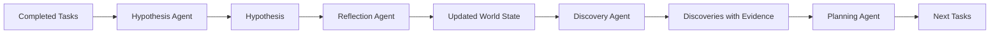

The Hypothesis Agent synthesizes findings from completed tasks into scientific hypotheses with inline citations. It can create new hypotheses or update existing ones based on new evidence.

## Function Signature

```typescript
// src/agents/hypothesis/index.ts
export async function hypothesisAgent(input: {
  objective: string;
  message: Message;
  conversationState: ConversationState;
  completedTasks: PlanTask[];
}): Promise<HypothesisResult>;

type HypothesisResult = {
  hypothesis: string;
  thought?: string;
  start: string;
  end: string;
  mode: "create" | "update";
};
```

## Modes

### Create Mode

Generates a new hypothesis when none exists:

```typescript
const result = await hypothesisAgent({
  objective: "Investigate mechanisms of cellular senescence",
  message,
  conversationState: {
    values: {
      currentHypothesis: undefined  // No existing hypothesis
    }
  },
  completedTasks: [
    {
      type: "LITERATURE",
      objective: "Search for p53 and senescence",
      output: "(p53 regulates senescence via p21)[10.1038/nature.2009.1234]..."
    }
  ]
});

// Returns:
// {
//   hypothesis: "We hypothesize that p53-mediated p21 activation is a key regulator of cellular senescence...",
//   mode: "create"
// }
```

### Update Mode

Updates existing hypothesis with new findings:

```typescript
const result = await hypothesisAgent({
  objective: "Investigate mechanisms of cellular senescence",
  message,
  conversationState: {
    values: {
      currentHypothesis: "We hypothesize that p53-mediated p21 activation regulates senescence..."
    }
  },
  completedTasks: [
    {
      type: "ANALYSIS",
      objective: "Analyze p21 expression levels",
      output: "Analysis shows 3.2-fold increase in p21 expression (p < 0.001)..."
    }
  ]
});

// Returns:
// {
//   hypothesis: "Our analysis confirms p53-mediated p21 activation as a key regulator. We now extend this to propose...",
//   mode: "update"
// }
```

## Hypothesis Structure

Generated hypotheses follow scientific conventions:

<Steps>
  <Step title="Context">
    Brief background establishing the research question
  </Step>
  
  <Step title="Hypothesis statement">
    Clear, testable proposition with inline citations
  </Step>
  
  <Step title="Supporting evidence">
    Key findings from completed tasks
  </Step>
  
  <Step title="Predictions">
    Expected outcomes if hypothesis is correct
  </Step>
</Steps>

### Example Output

```
Based on literature search and expression analysis, we hypothesize that 
cellular senescence is primarily regulated through the p53-p21 axis. 
(Previous studies show p53 directly activates p21 transcription)[10.1038/nature.2009.1234], 
and our analysis confirms a 3.2-fold increase in p21 expression in senescent cells (p < 0.001).

We predict that p53 knockdown will reduce p21 levels and delay senescence onset. 
Further analysis of downstream targets (p16INK4a, SASP factors) should reveal 
additional regulatory mechanisms.
```

## Usage Example

```typescript
// src/routes/chat.ts
const needsHypothesis = await requiresHypothesis(
  message,
  allLiteratureOutput,
  messageId
);

if (needsHypothesis && completedTasks.length > 0) {
  const hypothesisResult = await hypothesisAgent({
    objective: planningResult.currentObjective,
    message,
    conversationState,
    completedTasks
  });
  
  // Update conversation state
  conversationState.values.currentHypothesis = hypothesisResult.hypothesis;
  
  await updateConversationState(
    conversationState.id,
    conversationState.values
  );
}
```

## Citation Format

The agent preserves inline citations from task outputs:

```
(claim)[DOI or URL]
```

**Examples:**
- `(Rapamycin extends lifespan in mice)[10.1038/nature.2009.1234]`
- `(mTOR inhibition reduces protein synthesis)[https://example.com/paper]`

These citations are maintained through the entire workflow and appear in the final paper generation.

## Configuration

<ParamField path="HYP_LLM_PROVIDER" type="string" default="openai">
  LLM provider: `openai`, `anthropic`, `google`, or `openrouter`
</ParamField>

<ParamField path="HYP_LLM_MODEL" type="string" default="gpt-5">
  Model name for hypothesis generation
</ParamField>

## When to Generate Hypothesis

The system determines if a hypothesis is needed using an LLM check:

```typescript
// src/routes/chat.ts:requiresHypothesis
const needsHypothesis = await requiresHypothesis(
  question,
  literatureResults
);
```

A hypothesis IS needed if:
- Question asks about mechanisms, predictions, or causal relationships
- Question requires synthesizing multiple sources into novel insight
- Question is exploratory and needs a testable proposition

A hypothesis IS NOT needed if:
- Question asks for factual information or definitions
- Question can be answered directly from literature
- Question is a simple lookup or clarification

## Integration with Workflow

The hypothesis flows through the research cycle:



## Related

<CardGroup cols={3}>
  <Card title="Reflection Agent" icon="mirror" href="/agents/reflection">
    Updates world state with insights
  </Card>
  <Card title="Discovery Agent" icon="microscope" href="/agents/discovery">
    Identifies novel claims
  </Card>
  <Card title="Deep Research" icon="flask" href="/concepts/deep-research">
    Iterative research cycle
  </Card>
</CardGroup>