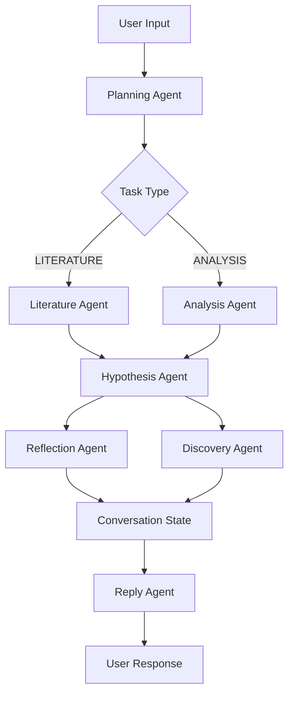

## System Architecture

BioAgents implements a **multi-agent architecture** where independent, specialized agents collaborate to perform scientific research. Each agent is a self-contained function that performs a specific task in the research workflow.

## Core Design Principles

<CardGroup cols={2}>
  <Card title="Modularity" icon="cubes">
    Agents are independent functions that can be composed and reused
  </Card>
  <Card title="Specialization" icon="microscope">
    Each agent focuses on one specific task (planning, literature, analysis, etc.)
  </Card>
  <Card title="State Management" icon="database">
    Clear separation between ephemeral message state and persistent conversation state
  </Card>
  <Card title="Parallel Execution" icon="bolt">
    Tasks execute concurrently for maximum performance
  </Card>
</CardGroup>

## Agent Types

BioAgents includes seven specialized agents:

### 1. Planning Agent

**Purpose**: Decides WHAT tasks to run based on current state and user input

**Location**: `src/agents/planning/index.ts`

**Key Responsibilities**:
- Analyzes available datasets and research context
- Generates task sequences (LITERATURE or ANALYSIS)
- Updates current research objectives

**State Updates**: Returns suggestions (no direct state mutation)

```typescript
const planningResult = await planningAgent({
  state,
  conversationState,
  message: createdMessage,
  mode: "initial",
  usageType: "deep-research",
  researchMode: "semi-autonomous"
});
```

### 2. Literature Agent

**Purpose**: Searches and synthesizes scientific literature

**Location**: `src/agents/literature/`

**Supported Backends**:
- **OPENSCHOLAR**: General scientific literature with citations
- **EDISON**: Deep research mode literature search
- **BIO**: BioAgents literature API (recommended)
- **KNOWLEDGE**: Custom knowledge base with semantic search

**Returns**: Synthesized findings with inline citations in format: `(claim)[DOI or URL]`

```typescript
const literatureResult = await literatureAgent({
  objective: task.objective,
  type: "BIO",
  onPollUpdate: ({ reasoning }) => {
    // Real-time progress updates
  }
});
```

### 3. Analysis Agent

**Purpose**: Performs data analysis on uploaded datasets

**Location**: `src/agents/analysis/`

**Supported Backends**:
- **EDISON**: Deep analysis via Edison AI agent
- **BIO**: BioAgents Data Analysis Agent (state-of-the-art)

**Key Features**:
- Uploads datasets to analysis service
- Executes analysis code
- Retrieves results and artifacts (plots, figures)

```typescript
const analysisResult = await analysisAgent({
  objective: task.objective,
  datasets: task.datasets,
  type: "BIO",
  userId: userId,
  conversationStateId: conversationStateId,
  onPollUpdate: ({ reasoning }) => {
    // Real-time reasoning traces
  }
});
```

### 4. Hypothesis Agent

**Purpose**: Generates research hypotheses from completed tasks

**Location**: `src/agents/hypothesis/`

**Key Responsibilities**:
- Synthesizes findings from literature and analysis
- Creates testable hypotheses with inline citations
- Considers current research context and objectives

**State Updates**: `currentHypothesis`

```typescript
const hypothesisResult = await hypothesisAgent({
  objective: currentObjective,
  message: createdMessage,
  conversationState,
  completedTasks: tasksToExecute
});
```

### 5. Reflection Agent

**Purpose**: Reflects on research progress and extracts insights

**Location**: `src/agents/reflection/`

**Key Responsibilities**:
- Extracts key insights and discoveries
- Updates research methodology
- Maintains conversation-level understanding
- Updates conversation title

**State Updates**: `currentObjective`, `keyInsights`, `methodology`, `conversationTitle`

```typescript
const reflectionResult = await reflectionAgent({
  conversationState,
  message: createdMessage,
  completedMaxTasks: tasksToExecute,
  hypothesis: hypothesisText
});
```

### 6. Discovery Agent

**Purpose**: Identifies novel claims with evidence links

**Location**: `src/agents/discovery/`

**Key Responsibilities**:
- Identifies novel scientific claims
- Links claims to supporting evidence (taskId, jobId)
- Maintains traceability: claims → evidence → tasks

**State Updates**: `discoveries[]`

```typescript
const discoveryResult = await discoveryAgent({
  conversationState,
  message: createdMessage,
  tasksToConsider,
  hypothesis: hypothesisText
});
```

### 7. Reply Agent

**Purpose**: Generates user-facing responses

**Location**: `src/agents/reply/`

**Modes**:
- **Deep Research Mode**: Includes current objective, next steps, asks for feedback
- **Chat Mode**: Concise answers without next steps

**Key Features**:
- Preserves inline citations throughout
- Adapts tone based on mode

## Agent Collaboration Pattern



## Two Main Routes

BioAgents operates through two primary routes:

### Chat Route

**Endpoint**: `POST /api/chat`

**Purpose**: Agent-based chat for general research questions with automatic literature search

**File**: `src/routes/chat.ts:46`

**Workflow**:
1. File Upload Agent (if files provided)
2. Planning Agent (literature tasks only)
3. Literature Agent (parallel execution)
4. Hypothesis Agent (if needed)
5. Reflection Agent (if hypothesis generated)
6. Reply Agent (concise response)

### Deep Research Route

**Endpoint**: `POST /api/deep-research/start`

**Purpose**: Iterative hypothesis-driven investigation with human-in-the-loop steering

**File**: `src/routes/deep-research/start.ts:115`

**Workflow**:
1. File Upload Agent (if files provided)
2. Planning Agent (literature + analysis tasks)
3. Execute tasks in parallel (Literature + Analysis)
4. Hypothesis Agent (synthesize findings)
5. Reflection Agent + Discovery Agent (parallel)
6. Planning Agent ("next" mode - plan next iteration)
7. Continue Research Agent (decide if autonomous continuation)
8. Reply Agent (with next steps and feedback request)

## Execution Modes

BioAgents supports two execution modes:

### In-Process Mode (Default)

```bash
USE_JOB_QUEUE=false bun run dev
```

- Jobs execute directly in the main process
- Simpler for development
- Lower latency

### Queue Mode (Production)

```bash
# Terminal 1: API server
USE_JOB_QUEUE=true bun run dev

# Terminal 2: Worker process
USE_JOB_QUEUE=true bun run worker
```

- Jobs queued in Redis via BullMQ
- Processed by separate worker processes
- Horizontal scaling support
- Automatic retries
- Admin dashboard at `/admin/queues`

<Info>
See [Job Queue documentation](/setup/job-queue) for detailed configuration.
</Info>

## Adding New Agents

To add a new agent:

1. **Create folder** in `src/agents/`
2. **Implement main function** in `index.ts`
3. **Add supporting logic** in separate files
4. **Export agent function** for use in routes
5. **Shared utilities** go in `src/utils/`

**Example Structure**:
```
src/agents/my-agent/
├── index.ts          # Main agent function
├── prompts.ts        # LLM prompts
├── utils.ts          # Helper functions
└── types.ts          # Type definitions
```

## LLM Integration

All agents use the unified LLM library at `src/llm/provider.ts`:

```typescript
import { LLM } from "../../llm/provider";

const llmProvider = new LLM({
  name: "anthropic",
  apiKey: process.env.ANTHROPIC_API_KEY
});

const response = await llmProvider.createChatCompletion({
  model: "claude-4.5-sonnet",
  messages: [
    { role: "system", content: character.system },
    { role: "user", content: prompt }
  ],
  maxTokens: 4096,
  messageId: message.id,
  usageType: "deep-research"
});
```

**Supported Providers**:
- Anthropic (Claude)
- OpenAI (GPT)
- Google (Gemini)
- OpenRouter

## Next Steps

<CardGroup cols={2}>
  <Card title="Agents" icon="robot" href="/concepts/agents">
    Detailed agent implementations
  </Card>
  <Card title="Deep Research" icon="flask" href="/concepts/deep-research">
    Deep research workflow
  </Card>
  <Card title="State Management" icon="database" href="/concepts/state-management">
    State vs ConversationState
  </Card>
  <Card title="Setup Guide" icon="wrench" href="/setup">
    Environment setup
  </Card>
</CardGroup>