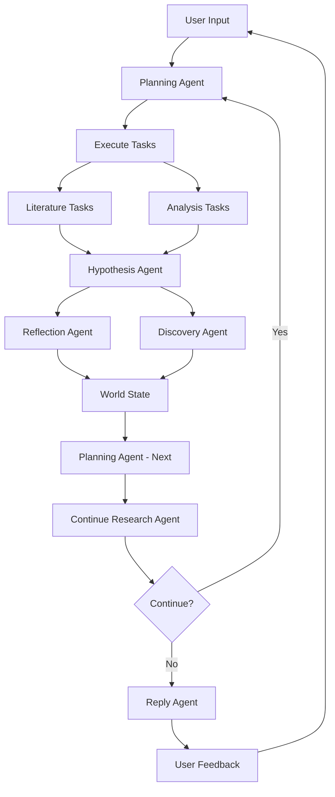

## Overview

Deep Research is the **primary way** to use BioAgents. It implements an iterative, hypothesis-driven research workflow where the AI behaves like a real scientist: methodical, evidence-based, and human-guided.

<Info>
Deep Research is more important than basic chat. It enables real scientific discovery through iterative human-AI collaboration.
</Info>

## Core Philosophy

### The Four Pillars

<CardGroup cols={2}>
  <Card title="Iterative Investigation" icon="arrows-rotate">
    Research unfolds across multiple cycles, each deepening understanding
  </Card>
  <Card title="Human-in-the-Loop" icon="user-check">
    Users guide the research direction at every iteration
  </Card>
  <Card title="Persistent World State" icon="database">
    All discoveries, hypotheses, and insights accumulate across the conversation
  </Card>
  <Card title="Evidence-Grounded" icon="link">
    Every discovery links to supporting tasks and data
  </Card>
</CardGroup>

## The Deep Research Cycle



### Detailed Workflow

<Steps>
  <Step title="Planning">
    Decides WHAT tasks to run based on current state and user input
    
    **Agent**: Planning Agent
    
    **Inputs**:
    - User message
    - Conversation state (objectives, insights, discoveries)
    - Uploaded datasets
    - Suggested next steps from previous iteration
    
    **Outputs**:
    - Current objective
    - Task list (LITERATURE and/or ANALYSIS)
  </Step>
  
  <Step title="Execution">
    Runs LITERATURE and ANALYSIS tasks in parallel
    
    **Literature Tasks**:
    - Search scientific literature (OpenScholar, BIO, Edison)
    - Search custom knowledge base
    - Return synthesized findings with citations
    
    **Analysis Tasks**:
    - Upload datasets to analysis service
    - Execute analysis code
    - Retrieve results and artifacts (plots, figures)
    
    **Parallelization**: All tasks at the same level run concurrently
  </Step>
  
  <Step title="Hypothesis">
    Synthesizes outputs into scientific claims
    
    **Agent**: Hypothesis Agent
    
    **Inputs**:
    - Completed tasks (literature + analysis outputs)
    - Current objective
    - Existing hypothesis (if any)
    
    **Outputs**:
    - Updated hypothesis with inline citations
    - Mode: create, update, or refine
    
    **State Update**: `currentHypothesis`
  </Step>
  
  <Step title="Reflection & Discovery">
    Updates world state with insights and identifies novel claims (parallel execution)
    
    **Reflection Agent**:
    - Extracts key insights
    - Updates methodology
    - Evolves research objectives
    - Updates conversation title
    
    **Discovery Agent**:
    - Identifies novel scientific claims
    - Links claims to evidence (taskId, jobId)
    - Maintains traceability
    
    **State Updates**:
    - `currentObjective`
    - `keyInsights[]`
    - `methodology`
    - `discoveries[]`
    - `conversationTitle`
  </Step>
  
  <Step title="Planning (Next)">
    Plans next iteration based on current progress
    
    **Agent**: Planning Agent (mode: "next")
    
    **Outputs**:
    - Suggested next steps
    - Next objective
    
    **State Update**: `suggestedNextSteps[]`
  </Step>
  
  <Step title="Continue Decision">
    Decides whether to continue autonomously or ask user
    
    **Agent**: Continue Research Agent
    
    **Inputs**:
    - Completed tasks
    - Current hypothesis
    - Suggested next steps
    - Iteration count
    - Research mode
    
    **Outputs**:
    - `shouldContinue`: boolean
    - `confidence`: 0-100
    - `reasoning`: explanation
    - `triggerReason`: why decision was made
  </Step>
  
  <Step title="Reply">
    Generates user-facing response with next steps
    
    **Agent**: Reply Agent
    
    **Includes**:
    - Current objective
    - Findings from this iteration
    - Key insights
    - Discoveries
    - Next steps (if not continuing)
    - Feedback request
  </Step>
</Steps>

## Research Modes

BioAgents supports three research modes:

### Semi-Autonomous (Default)

```bash
MAX_AUTO_ITERATIONS=5  # Default from env
```

- Continues autonomously for up to 5 iterations (configurable)
- Asks user for feedback after limit reached
- **Best for**: Focused research questions with clear endpoints

### Fully Autonomous

```typescript
{
  "message": "Investigate caloric restriction mechanisms",
  "researchMode": "fully-autonomous"
}
```

- Continues until research is complete or 20 iterations (hard cap)
- Minimal user intervention
- **Best for**: Open-ended exploration

### Steering

```typescript
{
  "message": "Investigate caloric restriction mechanisms",
  "researchMode": "steering"
}
```

- Single iteration only
- Always asks user for feedback
- **Best for**: Precise control over research direction

## World State Management

The "World State" is the accumulated knowledge that persists across iterations:

```typescript
type ConversationStateValues = {
  // Core objective
  objective: string; // Initial research question
  evolvingObjective?: string; // Slowly-evolving high-level direction
  currentObjective?: string; // Current iteration objective
  
  // Accumulated knowledge
  keyInsights?: string[]; // Key findings across all iterations
  discoveries?: Discovery[]; // Novel claims with evidence links
  methodology?: string; // Research methodology
  currentHypothesis?: string; // Current hypothesis with citations
  
  // Task tracking
  plan?: PlanTask[]; // All executed tasks (with level)
  suggestedNextSteps?: PlanTask[]; // Suggestions for next iteration
  currentLevel?: number; // Current iteration level
  
  // Datasets
  uploadedDatasets?: UploadedDataset[]; // All uploaded files
  
  // Metadata
  conversationTitle?: string; // Concise conversation title
};
```

### Traceability

Every discovery maintains complete traceability:

```typescript
type Discovery = {
  title: string;
  claim: string;
  summary: string;
  evidenceArray: Array<{
    taskId: string; // References PlanTask.id ("ana-1", "lit-1")
    jobId?: string; // External job ID (Edison, BIO)
    explanation: string;
  }>;
  artifacts: AnalysisArtifact[]; // Linked plots, figures
  novelty: string;
};
```

**Traceability chain**: Discovery → Evidence → Task → JobId → External Service

## Mini-Agent Collaboration

| Agent | Role | State Updates | When Runs |
|-------|------|---------------|------------|
| **Planning** | Decides WHAT tasks to run | Returns suggestions | Start of iteration, after reflection |
| **Hypothesis** | Synthesizes findings | `currentHypothesis` | After tasks complete |
| **Reflection** | Extracts insights | `currentObjective`, `keyInsights`, `methodology`, `conversationTitle` | After hypothesis |
| **Discovery** | Identifies novel claims | `discoveries[]` | After reflection (parallel) |
| **Continue Research** | Decides if autonomous continuation | None (returns decision) | After next planning |

<Warning>
Each agent only updates specific state fields to prevent conflicts and maintain clear causality.
</Warning>

## Task Levels

Tasks are organized by iteration level:

```typescript
type PlanTask = {
  id: string; // "ana-1", "lit-1", "ana-2", "lit-2", ...
  level: number; // 1, 2, 3, ...
  objective: string;
  type: "LITERATURE" | "ANALYSIS";
  datasets: Dataset[];
  start?: string; // ISO timestamp
  end?: string;
  output?: string;
  reasoning?: string[]; // Real-time traces
  artifacts?: AnalysisArtifact[];
  jobId?: string; // External job ID
};
```

**Leveling**:
- Level 1: First iteration tasks
- Level 2: Second iteration tasks
- Level N: Nth iteration tasks

**ID Format**: `{type}-{level}` (e.g., `ana-1`, `lit-1`, `ana-2`)

## External Services

<Warning>
LITERATURE and ANALYSIS tasks are executed by EXTERNAL services. This repository cannot control their execution - we only consume outputs.
</Warning>

### Literature Services

1. **OpenScholar** (optional)
   - General scientific literature
   - High-quality citations
   - Set `OPENSCHOLAR_API_URL`

2. **Edison** (optional)
   - Deep research mode only
   - Set `EDISON_API_URL`

3. **BIO** (recommended)
   - BioAgents Literature API
   - Semantic search with LLM reranking
   - Set `PRIMARY_LITERATURE_AGENT=bio`

4. **Knowledge Base**
   - Custom documents in `docs/`
   - Vector search with Cohere reranking

### Analysis Services

1. **Edison** (default)
   - Deep analysis via Edison AI
   - Set `EDISON_API_URL`

2. **BIO** (state-of-the-art)
   - BioAgents Data Analysis Agent
   - Set `PRIMARY_ANALYSIS_AGENT=bio`

## Real-time Updates

Both literature and analysis agents support real-time reasoning traces:

```typescript
const onPollUpdate = async ({ reasoning }) => {
  // Update task with latest reasoning
  task.reasoning = reasoning;
  
  // Persist to database
  await updateConversationState(conversationState.id, conversationState.values);
  
  // Notify WebSocket clients
  await notifyStateUpdated(jobId, conversationId, conversationState.id);
};

const result = await analysisAgent({
  objective: task.objective,
  datasets: task.datasets,
  type: "BIO",
  onPollUpdate
});
```

## API Endpoint

### Start Deep Research

**Endpoint**: `POST /api/deep-research/start`

**Request**:
```json
{
  "message": "Investigate mechanisms of caloric restriction on longevity",
  "conversationId": "optional-uuid",
  "researchMode": "semi-autonomous",
  "files": [/* File objects */]
}
```

**Response** (Queue Mode):
```json
{
  "jobId": "uuid",
  "messageId": "uuid",
  "conversationId": "uuid",
  "userId": "uuid",
  "status": "queued",
  "pollUrl": "/api/deep-research/status/uuid"
}
```

**Response** (In-Process Mode):
```json
{
  "messageId": "uuid",
  "conversationId": "uuid",
  "userId": "uuid",
  "status": "processing"
}
```

### Check Status

**Endpoint**: `GET /api/deep-research/status/:messageId`

**Response**:
```json
{
  "status": "completed",
  "message": {
    "content": "Based on the analysis...",
    "created_at": "2026-03-04T12:00:00Z"
  },
  "state": {
    "currentHypothesis": "...",
    "discoveries": [...],
    "keyInsights": [...]
  }
}
```

## Code Example

Here's the core deep research loop from `src/routes/deep-research/start.ts:830`:

```typescript
while (shouldContinueLoop && iterationCount < maxAutoIterations) {
  iterationCount++;
  
  // Step 1: Planning (or use promoted tasks from continuation)
  const planningResult = await planningAgent({
    state,
    conversationState,
    message: createdMessage,
    mode: "initial",
    usageType: "deep-research",
    researchMode
  });
  
  // Step 2: Execute tasks in parallel
  const taskPromises = tasksToExecute.map(async (task) => {
    if (task.type === "LITERATURE") {
      const result = await literatureAgent({
        objective: task.objective,
        type: "BIO",
        onPollUpdate
      });
      task.output = result.output;
    } else if (task.type === "ANALYSIS") {
      const result = await analysisAgent({
        objective: task.objective,
        datasets: task.datasets,
        type: "BIO",
        onPollUpdate
      });
      task.output = result.output;
      task.artifacts = result.artifacts;
    }
  });
  await Promise.all(taskPromises);
  
  // Step 3: Hypothesis
  const hypothesisResult = await hypothesisAgent({
    objective: currentObjective,
    message: createdMessage,
    conversationState,
    completedTasks: tasksToExecute
  });
  
  // Step 4: Reflection & Discovery (parallel)
  const [reflectionResult, discoveryResult] = await Promise.all([
    reflectionAgent({
      conversationState,
      message: createdMessage,
      completedMaxTasks: tasksToExecute,
      hypothesis: hypothesisResult.hypothesis
    }),
    discoveryAgent({
      conversationState,
      message: createdMessage,
      tasksToConsider: allCompletedTasks,
      hypothesis: hypothesisResult.hypothesis
    })
  ]);
  
  // Step 5: Planning (next)
  const nextPlanningResult = await planningAgent({
    state,
    conversationState,
    message: createdMessage,
    mode: "next",
    usageType: "deep-research",
    researchMode
  });
  
  // Step 6: Continue decision
  const continueResult = await continueResearchAgent({
    conversationState,
    message: currentMessage,
    completedTasks: tasksToExecute,
    hypothesis: hypothesisResult.hypothesis,
    suggestedNextSteps: conversationState.values.suggestedNextSteps,
    iterationCount,
    researchMode
  });
  
  shouldContinueLoop = continueResult.shouldContinue;
}
```

## Best Practices

<AccordionGroup>
  <Accordion title="Never Lose Discoveries">
    YOU MUST update the world state after every task completion. Never treat queries in isolation.
  </Accordion>
  
  <Accordion title="Maintain Traceability">
    Every discovery MUST link to supporting evidence (taskId, jobId). Maintain DOI citations for literature.
  </Accordion>
  
  <Accordion title="Human Steering Priority">
    User input ALWAYS overrides agent suggestions. Present clear next steps for approval.
  </Accordion>
  
  <Accordion title="Handle External Failures">
    External services (OpenScholar, Edison, BIO) may fail. Handle gracefully and continue workflow.
  </Accordion>
  
  <Accordion title="Evolve Hypotheses">
    Hypotheses MUST evolve based on new findings. They are not static.
  </Accordion>
</AccordionGroup>

## Next Steps

<CardGroup cols={2}>
  <Card title="Architecture" icon="sitemap" href="/concepts/architecture">
    Multi-agent system overview
  </Card>
  <Card title="Agents" icon="robot" href="/concepts/agents">
    Individual agent details
  </Card>
  <Card title="State Management" icon="database" href="/concepts/state-management">
    Understanding state types
  </Card>
  <Card title="API Reference" icon="code" href="/api/deep-research">
    Deep research API docs
  </Card>
</CardGroup>