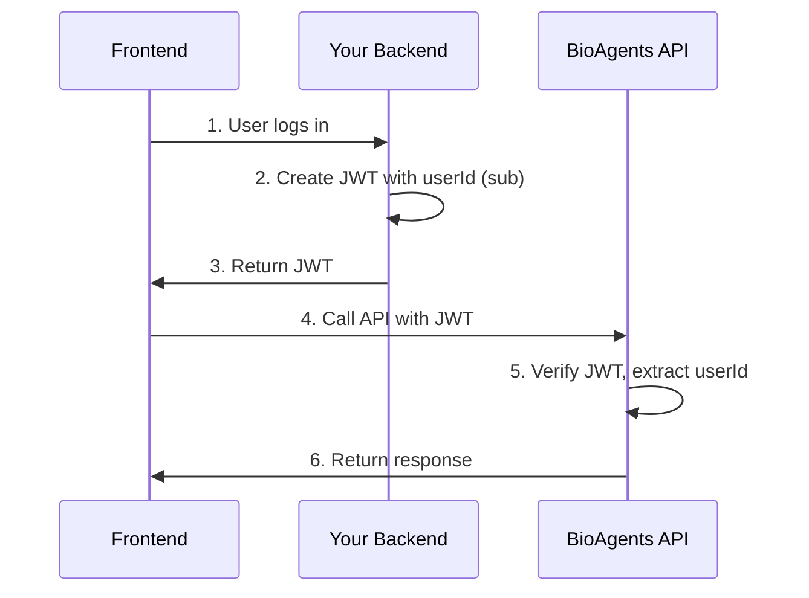
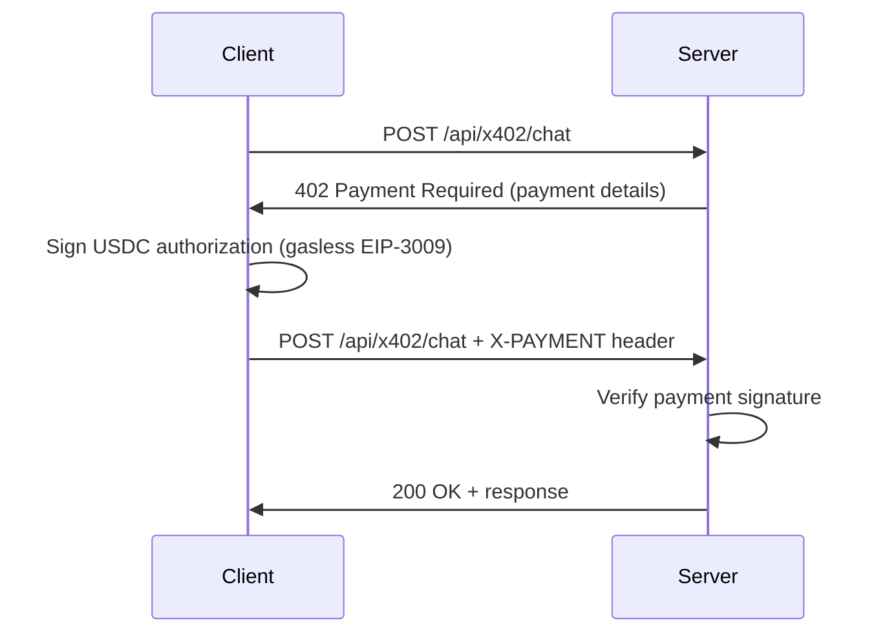

BioAgents supports three authentication methods: **JWT authentication** for external frontends, **x402** for USDC micropayments on Base, and **b402** for USDT micropayments on BNB Chain.

## Authentication Methods

| Setting | Options | Purpose |
|---------|---------|------|
| `AUTH_MODE` | `none` / `jwt` | JWT authentication for external frontends |
| `X402_ENABLED` | `true` / `false` | x402 USDC micropayments on Base |
| `B402_ENABLED` | `true` / `false` | b402 USDT micropayments on BNB Chain |

<Info>
  Authentication methods are independent and can be combined. Payment authentication (x402/b402) takes priority over JWT.
</Info>

## JWT Authentication

For external frontends connecting to the API. Your backend authenticates users and signs JWTs with a shared secret.

### Quick Start

<Steps>
  <Step title="Generate Secret">
    Generate a secure random secret:
    
    ```bash
    openssl rand -hex 32
    ```
  </Step>
  
  <Step title="Configure Environment">
    ```bash
    AUTH_MODE=jwt
    BIOAGENTS_SECRET=your-secure-secret-here
    MAX_JWT_EXPIRATION=3600  # Optional: 1 hour max
    ```
  </Step>
  
  <Step title="Sign JWTs in Your Backend">
    See code examples below for signing JWTs in your backend.
  </Step>
  
  <Step title="Call API with JWT">
    Include the JWT in the `Authorization` header:
    
    ```bash
    curl -X POST https://your-api.com/api/chat \
      -H "Authorization: Bearer YOUR_JWT_TOKEN" \
      -H "Content-Type: application/json" \
      -d '{"message": "What is rapamycin?"}'
    ```
  </Step>
</Steps>

### How JWT Auth Works



### JWT Payload Requirements

The JWT payload must include the following claims:

<ParamField path="sub" type="string" required>
  User ID as a valid UUID. This identifies the user in the database.
  
  <Warning>Must be a valid UUID format. Generate with `crypto.randomUUID()` or equivalent.</Warning>
</ParamField>

<ParamField path="exp" type="number" required>
  Expiration timestamp (Unix epoch time).
  
  Maximum expiration is controlled by `MAX_JWT_EXPIRATION` (default: 3600 seconds).
</ParamField>

<ParamField path="iat" type="number" required>
  Issued at timestamp (Unix epoch time).
</ParamField>

<ParamField path="email" type="string">
  User email (optional).
</ParamField>

<ParamField path="orgId" type="string">
  Organization ID for multi-tenant deployments (optional).
</ParamField>

### Code Examples

<CodeGroup>

```typescript Node.js (jose)
import * as jose from 'jose';

const secret = new TextEncoder().encode(process.env.BIOAGENTS_SECRET);

const jwt = await new jose.SignJWT({
  sub: 'a1b2c3d4-e5f6-7890-abcd-ef1234567890'  // Must be UUID
})
  .setProtectedHeader({ alg: 'HS256' })
  .setIssuedAt()
  .setExpirationTime('1h')
  .sign(secret);

// Call BioAgents API
const response = await fetch('https://your-bioagents-api/api/chat', {
  method: 'POST',
  headers: {
    'Authorization': `Bearer ${jwt}`,
    'Content-Type': 'application/json'
  },
  body: JSON.stringify({ message: 'What is rapamycin?' })
});
```

```typescript Node.js (jsonwebtoken)
import jwt from 'jsonwebtoken';

const token = jwt.sign(
  { sub: 'a1b2c3d4-e5f6-7890-abcd-ef1234567890' },
  process.env.BIOAGENTS_SECRET!,
  { algorithm: 'HS256', expiresIn: '1h' }
);

// Call BioAgents API
const response = await fetch('https://your-bioagents-api/api/chat', {
  method: 'POST',
  headers: {
    'Authorization': `Bearer ${token}`,
    'Content-Type': 'application/json'
  },
  body: JSON.stringify({ message: 'What is rapamycin?' })
});
```

```python Python (PyJWT)
import jwt
import os
from datetime import datetime, timedelta

token = jwt.encode(
    {
        'sub': 'a1b2c3d4-e5f6-7890-abcd-ef1234567890',
        'exp': datetime.utcnow() + timedelta(hours=1),
        'iat': datetime.utcnow()
    },
    os.environ['BIOAGENTS_SECRET'],
    algorithm='HS256'
)

# Call BioAgents API
import requests

response = requests.post(
    'https://your-bioagents-api/api/chat',
    headers={
        'Authorization': f'Bearer {token}',
        'Content-Type': 'application/json'
    },
    json={'message': 'What is rapamycin?'}
)
```

</CodeGroup>

### Important Notes

<Warning>
  **Never expose `BIOAGENTS_SECRET`** - Generate JWTs server-side only. Never send the secret to the client.
</Warning>

<Info>
  **Same user = same UUID** - Use consistent UUIDs per user to maintain conversation history.
</Info>

<Tip>
  **Use short expiration** - 1 hour recommended, max configurable via `MAX_JWT_EXPIRATION`.
</Tip>

## x402 Payment Protocol

Pay-per-request access using USDC micropayments on Base network.

### Features

<CardGroup cols={2}>
  <Card title="Gasless Transfers" icon="gas-pump">
    EIP-3009 for fee-free USDC transfers
  </Card>
  <Card title="Embedded Wallets" icon="wallet">
    Email-based wallet creation via CDP
  </Card>
  <Card title="HTTP 402 Flow" icon="money-bill">
    Standard "Payment Required" protocol
  </Card>
  <Card title="Base Network" icon="link">
    Supports testnet (Base Sepolia) and mainnet
  </Card>
</CardGroup>

### Configuration

<Steps>
  <Step title="Get Coinbase CDP Credentials">
    Get credentials from [Coinbase Developer Portal](https://portal.cdp.coinbase.com/access/api):
    
    ```bash
    CDP_API_KEY_ID=your_key_id
    CDP_API_KEY_SECRET=your_key_secret
    CDP_PROJECT_ID=your_project_id
    ```
  </Step>
  
  <Step title="Configure x402">
    ```bash
    X402_ENABLED=true
    X402_PAYMENT_ADDRESS=0xYourWalletAddress
    X402_ENVIRONMENT=testnet  # or 'mainnet'
    X402_NETWORK=base-sepolia  # or 'base' for mainnet
    X402_USDC_ADDRESS=0x036CbD53842c5426634e7929541eC2318f3dCF7e
    ```
  </Step>
  
  <Step title="Test Payment Flow">
    Use the x402 client library to test payments:
    
    ```javascript
    import { x402Fetch } from 'x402-fetch';
    
    const response = await x402Fetch('http://localhost:3000/api/x402/chat', {
      method: 'POST',
      body: JSON.stringify({ message: 'What is DNA?' }),
      x402: {
        privateKey: process.env.WALLET_PRIVATE_KEY,
        network: 'base-sepolia'
      }
    });
    ```
  </Step>
</Steps>

### How x402 Works



### x402 Environment Variables

<ParamField path="X402_ENABLED" type="boolean" default="false">
  Enable x402 payment protocol.
</ParamField>

<ParamField path="X402_ENVIRONMENT" type="string" default="testnet">
  Environment: `testnet` (Base Sepolia) or `mainnet` (Base).
</ParamField>

<ParamField path="X402_PAYMENT_ADDRESS" type="string" required>
  Your wallet address (0x...) to receive payments.
</ParamField>

<ParamField path="X402_FACILITATOR_URL" type="string" default="https://x402.org/facilitator">
  x402 facilitator service URL.
</ParamField>

<ParamField path="X402_NETWORK" type="string" default="base-sepolia">
  Network: `base-sepolia` (testnet) or `base` (mainnet).
</ParamField>

<ParamField path="X402_ASSET" type="string" default="USDC">
  Payment asset (USDC).
</ParamField>

<ParamField path="X402_USDC_ADDRESS" type="string" default="0x036CbD53842c5426634e7929541eC2318f3dCF7e">
  USDC contract address (testnet default shown).
</ParamField>

<ParamField path="X402_TIMEOUT" type="number" default="30">
  Payment timeout in seconds.
</ParamField>

### Pricing

Default: $0.01 per request. Configure in `src/x402/pricing.ts`:

```typescript src/x402/pricing.ts
export const routePricing: RoutePricing[] = [
  {
    route: "/api/x402/chat",
    priceUSD: "0.01",
    description: "Chat API access",
  },
];
```

## b402 Payment Protocol

Pay-per-request access using USDT micropayments on BNB Chain.

### Configuration

```bash
B402_ENABLED=true
B402_ENVIRONMENT=testnet  # or 'mainnet'
B402_PAYMENT_ADDRESS=0xYourWalletAddress
B402_FACILITATOR_URL=https://facilitator.bioagents.dev
B402_NETWORK=bnb-testnet  # or 'bnb' for mainnet
B402_ASSET=USDT
B402_USDT_ADDRESS=0x337610d27c682E347C9cD60BD4b3b107C9d34dDd  # Testnet
B402_TIMEOUT=30
```

<Info>
  b402 works identically to x402 but uses USDT on BNB Chain instead of USDC on Base.
</Info>

## Authentication Priority

When multiple auth methods are available, the system uses this priority:

1. **x402/b402 payment proof** - Cryptographic wallet signature (highest trust)
2. **JWT token** - Verified signature
3. **Anonymous** - Only if `AUTH_MODE=none`

## Combining JWT + Payment Auth

You can enable both systems simultaneously:

```bash
AUTH_MODE=jwt
X402_ENABLED=true
```

This allows:
- JWT-authenticated users to access `/api/chat` and `/api/deep-research/*` (no payment)
- Anyone to pay-per-request via `/api/x402/chat` and `/api/x402/deep-research/*`

## API Endpoints

| Endpoint | Auth Required | Payment Required |
|----------|--------------|------------------|
| `/api/chat` | JWT (if `AUTH_MODE=jwt`) | No |
| `/api/x402/chat` | No | Yes (x402) |
| `/api/b402/chat` | No | Yes (b402) |
| `/api/deep-research/start` | JWT (if `AUTH_MODE=jwt`) | No |
| `/api/deep-research/status` | JWT (if `AUTH_MODE=jwt`) | No |
| `/api/x402/deep-research/start` | No | Yes (x402) |
| `/api/x402/deep-research/status` | No | Yes (x402) |
| `/api/x402/config` | No | No |
| `/api/health` | No | No |

## Database Schema

### Payment Tracking - `x402_payments`

```sql
CREATE TABLE x402_payments (
  id UUID PRIMARY KEY,
  user_id UUID REFERENCES users(id),
  conversation_id UUID REFERENCES conversations(id),
  message_id UUID REFERENCES messages(id),
  amount_usd NUMERIC NOT NULL,
  amount_wei TEXT NOT NULL,
  asset TEXT DEFAULT 'USDC',
  network TEXT NOT NULL,
  tools_used TEXT[],
  tx_hash TEXT,
  payment_status TEXT CHECK (payment_status IN ('pending', 'verified', 'settled', 'failed')),
  payment_header JSONB,
  payment_requirements JSONB,
  error_message TEXT,
  created_at TIMESTAMPTZ DEFAULT NOW(),
  verified_at TIMESTAMPTZ,
  settled_at TIMESTAMPTZ
);
```

## Implementation Files

| File | Purpose |
|------|------|
| `src/middleware/authResolver.ts` | Unified auth middleware |
| `src/services/jwt.ts` | JWT verification |
| `src/middleware/x402.ts` | Payment enforcement |
| `src/x402/service.ts` | Payment verification |
| `src/types/auth.ts` | Auth types |

## Troubleshooting

<AccordionGroup>
  <Accordion title="JWT Authentication Failed">
    **Symptom**: 401 Unauthorized
    
    **Solutions**:
    - Verify `BIOAGENTS_SECRET` matches on both sides
    - Check JWT expiration (max 1 hour by default)
    - Ensure `sub` claim is a valid UUID
    - Verify `AUTH_MODE=jwt` is set on server
  </Accordion>
  
  <Accordion title="Payment Verification Failed">
    **Symptom**: `x402_payment_invalid` error
    
    **Solutions**:
    - Check USDC/USDT balance in wallet
    - Verify network configuration (testnet vs mainnet)
    - Ensure facilitator URL is correct
    - Check payment signature is valid
  </Accordion>
  
  <Accordion title="x402/b402 Routes Not Available">
    **Symptom**: 404 on `/api/x402/*` or `/api/b402/*` routes
    
    **Solutions**:
    - Verify `X402_ENABLED=true` or `B402_ENABLED=true` is set
    - Restart server after changing `.env`
    - Check server logs for initialization errors
  </Accordion>
  
  <Accordion title="Invalid UUID Format">
    **Symptom**: Database error about invalid UUID
    
    **Solutions**:
    - Ensure `sub` claim is a valid UUID format
    - Use `crypto.randomUUID()` to generate UUIDs
    - Don't use email addresses or usernames as `sub`
  </Accordion>
</AccordionGroup>

## Resources

<CardGroup cols={2}>
  <Card title="x402 Protocol" icon="link" href="https://x402.org">
    Learn about the x402 payment protocol
  </Card>
  <Card title="Coinbase CDP" icon="coinbase" href="https://portal.cdp.coinbase.com">
    Get Coinbase Developer Platform credentials
  </Card>
  <Card title="Base Network" icon="link" href="https://base.org">
    Learn about Base network
  </Card>
  <Card title="EIP-3009" icon="file" href="https://eips.ethereum.org/EIPS/eip-3009">
    Transfer With Authorization standard
  </Card>
</CardGroup>

## Next Steps

<CardGroup cols={2}>
  <Card title="Environment Variables" icon="gear" href="/configuration/environment">
    View all configuration options
  </Card>
  <Card title="Storage" icon="database" href="/configuration/storage">
    Configure S3 storage for file uploads
  </Card>
</CardGroup>