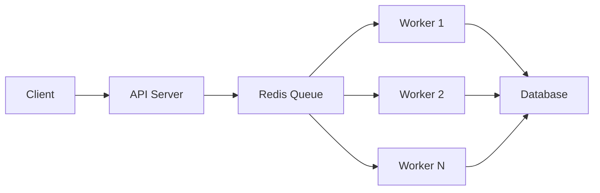

BioAgents can be deployed in multiple configurations depending on your scale and reliability requirements.

## Architecture Patterns

### Simple Deployment

Single container running both API server and job processing in-process. Best for:
- Development environments
- Low-traffic deployments
- Quick demos and prototypes

<CodeGroup>
```bash Single Container
docker run -p 3000:3000 \
  -e USE_JOB_QUEUE=false \
  -e OPENAI_API_KEY=your-key \
  bioagents:latest
```
</CodeGroup>

### Production Deployment

Separate API server and worker processes with Redis queue. Best for:
- Production environments
- High-traffic applications
- Horizontal scaling requirements
- Reliability and fault tolerance



## Deployment Options

<CardGroup cols={2}>
  <Card title="Docker Compose" icon="docker" href="/deployment/docker">
    Deploy using docker-compose for local or single-server production
  </Card>
  <Card title="Job Queue" icon="list-check" href="/deployment/job-queue">
    Configure BullMQ with Redis for reliable background processing
  </Card>
  <Card title="Horizontal Scaling" icon="arrows-up-to-line" href="/deployment/scaling">
    Scale workers across multiple servers for high throughput
  </Card>
</CardGroup>

## Service Components

### API Server

**Responsibilities:**
- Handle HTTP requests and WebSocket connections
- Enqueue jobs to Redis
- Broadcast real-time notifications to clients
- Serve static frontend files

**Scaling:** Can scale horizontally with a load balancer. WebSocket connections require sticky sessions.

### Worker Process

**Responsibilities:**
- Process jobs from Redis queues
- Execute AI agent workflows
- Publish progress notifications via Redis Pub/Sub
- Update database with results

**Scaling:** Can scale horizontally without any coordination. Workers automatically share the queue.

### Redis

**Responsibilities:**
- Message broker for BullMQ queues
- Pub/Sub for real-time notifications
- Job state persistence

**Scaling:** Can use Redis Cluster or managed services like Upstash for high availability.

### Database (Supabase/PostgreSQL)

**Responsibilities:**
- Store conversations, messages, and state
- User authentication and authorization
- File metadata and references

**Scaling:** Managed by Supabase or your PostgreSQL provider.

## Running Modes

### In-Process Mode

```bash
USE_JOB_QUEUE=false bun run start
```

<Note>
**When to use:** Development, low-traffic deployments

**Pros:** Simple setup, no Redis required

**Cons:** Cannot scale horizontally, jobs block API server
</Note>

### Queue Mode

```bash
# Terminal 1: API Server
USE_JOB_QUEUE=true bun run start

# Terminal 2: Worker
USE_JOB_QUEUE=true bun run worker
```

<Note>
**When to use:** Production deployments, high-traffic applications

**Pros:** Horizontal scaling, fault tolerance, graceful job handling

**Cons:** Requires Redis infrastructure
</Note>

## Environment Requirements

### Required

<ParamField path="OPENAI_API_KEY" type="string" required>
  OpenAI API key for LLM models (or use alternative providers)
</ParamField>

<ParamField path="SUPABASE_URL" type="string" required>
  Supabase project URL for database access
</ParamField>

<ParamField path="SUPABASE_ANON_KEY" type="string" required>
  Supabase anonymous key for client authentication
</ParamField>

### Queue Mode

<ParamField path="USE_JOB_QUEUE" type="boolean" default="false">
  Enable BullMQ job queue (required for production)
</ParamField>

<ParamField path="REDIS_URL" type="string">
  Redis connection URL (e.g., `redis://localhost:6379`)
</ParamField>

### Optional

<ParamField path="BIOAGENTS_SECRET" type="string">
  JWT signing key for authentication
</ParamField>

<ParamField path="AUTH_MODE" type="string" default="none">
  Authentication mode: `none` or `jwt`
</ParamField>

## Resource Requirements

### API Server

| Traffic | CPU | Memory | Instances |
|---------|-----|--------|-----------|
| Light (< 10 users) | 1 core | 512MB | 1 |
| Medium (10-50 users) | 2 cores | 1GB | 2 |
| Heavy (50+ users) | 4 cores | 2GB | 3+ |

### Worker

| Workload | CPU | Memory | Workers |
|----------|-----|--------|---------|
| Light (< 10 jobs/hr) | 1 core | 1GB | 2 |
| Medium (10-50 jobs/hr) | 2 cores | 2GB | 4 |
| Heavy (50+ jobs/hr) | 4 cores | 4GB | 8+ |

<Warning>
Deep research jobs can consume significant memory (500MB-1GB per job). Size worker memory accordingly.
</Warning>

### Redis

| Scenario | Memory | Concurrent Jobs |
|----------|--------|----------------|
| Development | 256MB | ~50 |
| Light Production | 512MB | ~100 |
| Medium Production | 1GB | ~500 |
| Heavy Production | 2GB+ | 1000+ |

## Health Checks

BioAgents provides a health endpoint for monitoring:

```bash
curl http://localhost:3000/api/health
```

**Response:**

```json
{
  "status": "ok",
  "timestamp": "2024-01-15T10:30:00.000Z",
  "jobQueue": {
    "enabled": true,
    "redis": "connected"
  }
}
```

## Monitoring

### Bull Board Dashboard

Access the job queue dashboard at `/admin/queues` when queue mode is enabled:

- View queue status and metrics
- Inspect job data and results
- Retry failed jobs
- Pause/resume queues

### Logs

BioAgents uses structured logging with Pino:

```bash
# View API server logs
docker logs -f bioagents-api

# View worker logs
docker logs -f bioagents-worker

# Filter by level
docker logs bioagents-api | grep '"level":50'  # errors only
```

## Next Steps

<CardGroup cols={2}>
  <Card title="Docker Setup" icon="docker" href="/deployment/docker">
    Learn how to deploy with docker-compose
  </Card>
  <Card title="Job Queue" icon="list-check" href="/deployment/job-queue">
    Configure BullMQ for reliable job processing
  </Card>
</CardGroup>
