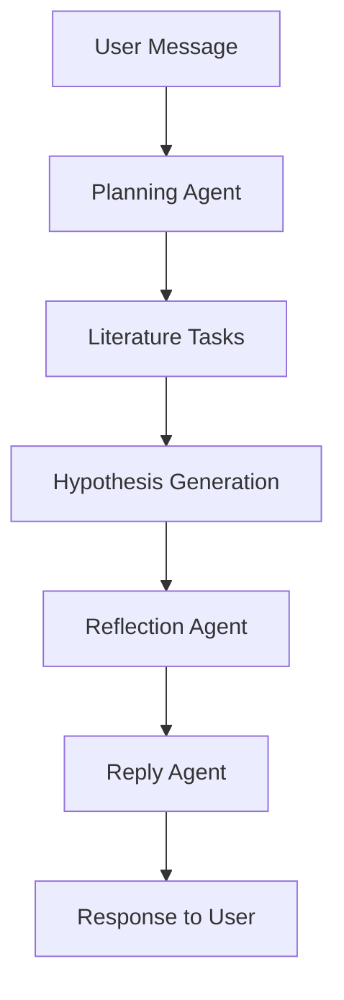

## Overview

Chat Mode provides a streamlined interface for quick questions, literature lookups, and simple analysis tasks. Unlike Deep Research, Chat Mode executes a single planning and execution cycle without autonomous iteration.

<Card title="When to Use Chat Mode" icon="lightbulb">
  - Quick literature lookups and fact-checking
  - Simple data interpretation questions
  - Following up on Deep Research results
  - Testing hypotheses without full research cycles
</Card>

## Architecture



Chat Mode follows a simplified agent workflow:

1. **Planning** - Determines what literature tasks to run
2. **Execution** - Runs literature searches in parallel
3. **Hypothesis** - Synthesizes findings (optional, based on query)
4. **Reflection** - Extracts key insights
5. **Reply** - Generates concise user-facing response

## API Endpoint

<CodeGroup>
```bash cURL
curl -X POST https://api.bioagents.ai/api/chat \
  -H "Authorization: Bearer YOUR_JWT_TOKEN" \
  -H "Content-Type: application/json" \
  -d '{
    "message": "What are the latest findings on autophagy and aging?",
    "conversationId": "optional-conversation-id"
  }'
```

```typescript TypeScript
interface ChatRequest {
  message: string;
  conversationId?: string; // Auto-generated if not provided
  files?: File[];           // Optional file uploads
}

interface ChatResponse {
  text: string;
  userId: string;
}

const response = await fetch('https://api.bioagents.ai/api/chat', {
  method: 'POST',
  headers: {
    'Authorization': `Bearer ${token}`,
    'Content-Type': 'application/json'
  },
  body: JSON.stringify({
    message: 'What are the latest findings on autophagy and aging?'
  })
});

const data: ChatResponse = await response.json();
```

```python Python
import requests

response = requests.post(
    'https://api.bioagents.ai/api/chat',
    headers={'Authorization': f'Bearer {token}'},
    json={
        'message': 'What are the latest findings on autophagy and aging?',
        'conversationId': 'optional-id'
    }
)

data = response.json()
print(data['text'])
```
</CodeGroup>

## Request Parameters

<ParamField path="message" type="string" required>
  The user's question or request
</ParamField>

<ParamField path="conversationId" type="string">
  Existing conversation ID. Auto-generated if not provided.
</ParamField>

<ParamField path="files" type="File[]">
  Optional files to upload and analyze (CSV, Excel, PDF, etc.)
</ParamField>

## Response Format

```json
{
  "text": "Recent research on autophagy and aging reveals...",
  "userId": "550e8400-e29b-41d4-a716-446655440000"
}
```

## Chat Workflow Deep Dive

### Step 1: User Authentication

The `authResolver` middleware handles multiple authentication methods:

```typescript src/routes/chat.ts
// Auth context handles: x402 wallet > JWT token > API key > body.userId > anonymous
const auth = (request as any).auth as AuthContext | undefined;
let userId = auth?.userId || generateUUID();
const source = auth?.method === "x402" ? "x402" : "api";
```

**Supported Auth Methods:**
- JWT tokens (via `Authorization: Bearer` header)
- API keys (via `X-API-Key` header)
- x402/b402 payment protocols (cryptocurrency-gated access)
- Anonymous (generates ephemeral UUID)

### Step 2: Planning Agent

The planning agent analyzes the user's message and conversation state to determine what tasks to execute:

```typescript src/routes/chat.ts
const planningResult = await planningAgent({
  state,
  conversationState,
  message: createdMessage,
  mode: "initial",
  usageType: "chat",
});

const plan = planningResult.plan;

// Filter to only LITERATURE tasks (no ANALYSIS for regular chat)
const literatureTasks = plan.filter((task) => task.type === "LITERATURE");
```

<Info>
  Chat mode only executes **LITERATURE** tasks by default. For data analysis, use Deep Research mode or file uploads.
</Info>

### Step 3: Literature Search

Literature tasks execute in parallel across multiple sources:

```typescript src/routes/chat.ts
for (const task of literatureTasks) {
  const literaturePromises: Promise<void>[] = [];

  // OpenScholar (if OPENSCHOLAR_API_URL configured)
  if (process.env.OPENSCHOLAR_API_URL) {
    literaturePromises.push(
      literatureAgent({
        objective: task.objective,
        type: "OPENSCHOLAR",
      })
    );
  }

  // BioLit (if PRIMARY_LITERATURE_AGENT=BIO)
  if (useBioLiterature) {
    literaturePromises.push(
      literatureAgent({
        objective: task.objective,
        type: "BIOLIT",
      })
    );
  }

  // Knowledge base (if KNOWLEDGE_DOCS_PATH configured)
  if (process.env.KNOWLEDGE_DOCS_PATH) {
    literaturePromises.push(
      literatureAgent({
        objective: task.objective,
        type: "KNOWLEDGE",
      })
    );
  }

  await Promise.all(literaturePromises);
}
```

**Literature Sources:**
- **OpenScholar** - Academic literature API
- **BioLit** - Specialized biomedical literature
- **Knowledge Base** - Custom vector search over uploaded documents

### Step 4: Hypothesis Generation (Optional)

Chat mode intelligently decides whether a hypothesis is needed:

```typescript src/routes/chat.ts
/**
 * Check if the question requires a hypothesis using LLM
 */
async function requiresHypothesis(
  question: string,
  literatureResults: string,
  messageId?: string
): Promise<boolean> {
  const prompt = `Analyze this user question and literature results to determine if a research hypothesis is needed.

User Question: ${question}

Literature Results Preview: ${literatureResults.slice(0, 1000)}

A hypothesis IS needed if:
- The question asks about mechanisms, predictions, or causal relationships
- The question requires synthesizing multiple sources into a novel insight
- The question is exploratory and needs a testable proposition

A hypothesis IS NOT needed if:
- The question asks for factual information or definitions
- The question can be answered directly from literature
- The question is a simple lookup or clarification

Respond with ONLY "YES" if a hypothesis is needed, or "NO" if it's not needed.`;

  const response = await llmProvider.createChatCompletion({
    model: process.env.PLANNING_LLM_MODEL || "gemini-2.5-flash",
    messages: [{ role: "user", content: prompt }],
    maxTokens: 10,
  });

  return response.content.trim().toUpperCase() === "YES";
}
```

If hypothesis generation is triggered:

```typescript src/routes/chat.ts
const hypothesisResult = await hypothesisAgent({
  objective: planningResult.currentObjective,
  message: createdMessage,
  conversationState,
  completedTasks,
});

conversationState.values.currentHypothesis = hypothesisResult.hypothesis;
```

### Step 5: Reflection

When a hypothesis is generated, the reflection agent extracts insights:

```typescript src/routes/chat.ts
const reflectionResult = await reflectionAgent({
  conversationState,
  message: createdMessage,
  completedMaxTasks: completedTasks,
  hypothesis: hypothesisText,
});

// Update conversation state with reflection results
conversationState.values.currentObjective = reflectionResult.currentObjective;
conversationState.values.keyInsights = reflectionResult.keyInsights;
conversationState.values.discoveries = reflectionResult.discoveries;
conversationState.values.methodology = reflectionResult.methodology;
```

### Step 6: Reply Generation

The final step generates a concise, user-facing response:

```typescript src/routes/chat.ts
const replyText = await generateChatReply(
  message,
  {
    completedTasks,
    hypothesis: hypothesisText,
    nextPlan: [], // No next plan for regular chat
    keyInsights: conversationState.values.keyInsights || [],
    discoveries: conversationState.values.discoveries || [],
    methodology: conversationState.values.methodology,
    currentObjective: conversationState.values.currentObjective,
    uploadedDatasets: conversationState.values.uploadedDatasets || [],
  },
  {
    maxTokens: 1024,
    messageId: createdMessage.id,
    usageType: "chat",
  }
);
```

## Dual Mode Execution

Chat mode supports two execution modes:

### In-Process Mode (Default)

```bash
USE_JOB_QUEUE=false
```

- Executes directly in the API server process
- Returns response immediately when complete
- Simpler for development
- Limited concurrency

### Queue Mode (Production)

```bash
USE_JOB_QUEUE=true
```

- Jobs are queued in Redis via BullMQ
- Worker processes handle execution
- Returns job ID immediately (202 Accepted)
- Supports horizontal scaling

```typescript src/routes/chat.ts
if (isJobQueueEnabled()) {
  // QUEUE MODE: Enqueue job and return immediately
  const job = await chatQueue.add(
    `chat-${createdMessage.id}`,
    {
      userId,
      conversationId,
      messageId: createdMessage.id,
      message,
    },
    {
      jobId: createdMessage.id, // Use message ID as job ID
    }
  );

  return {
    jobId: job.id!,
    messageId: createdMessage.id,
    conversationId,
    userId,
    status: "queued",
    pollUrl: `/api/chat/status/${job.id}`,
  };
}
```

**Polling for Results:**

```bash
curl https://api.bioagents.ai/api/chat/status/550e8400-e29b-41d4-a716-446655440000
```

Response:
```json
{
  "status": "completed",
  "result": {
    "text": "Recent research on autophagy and aging reveals..."
  }
}
```

## File Upload Support

Chat mode supports file uploads for context-aware responses:

```typescript
const formData = new FormData();
formData.append('message', 'Analyze this gene expression data');
formData.append('files', csvFile);

const response = await fetch('https://api.bioagents.ai/api/chat', {
  method: 'POST',
  headers: {
    'Authorization': `Bearer ${token}`,
  },
  body: formData
});
```

**File Processing Flow:**

```typescript src/routes/chat.ts
// Step 1: Process files if any
if (files.length > 0) {
  const { fileUploadAgent } = await import("../agents/fileUpload");

  const fileResult = await fileUploadAgent({
    conversationState,
    files,
    userId: state.values.userId || "unknown",
  });

  // Files are parsed, uploaded to S3, and descriptions generated
}
```

See [File Upload](/features/file-upload) for detailed documentation.

## Rate Limiting

Chat requests are rate-limited per user:

```typescript src/middleware/rateLimiter.ts
rateLimitMiddleware("chat")
```

Default limits:
- **10 requests per minute** (configurable via `RATE_LIMIT_CHAT_REQUESTS_PER_MINUTE`)
- Rate limits enforced per `userId`

## Error Handling

```json
// 400 Bad Request - Missing message
{
  "ok": false,
  "error": "Missing required field: message"
}

// 401 Unauthorized - Invalid auth
{
  "ok": false,
  "error": "Authentication required",
  "message": "Please provide a valid JWT or API key"
}

// 500 Internal Server Error
{
  "ok": false,
  "error": "Internal server error"
}
```

## Conversation Continuity

Chat mode maintains conversation state across messages:

```typescript
// First message
await fetch('/api/chat', {
  body: JSON.stringify({
    message: 'What is autophagy?'
  })
});
// Returns: { conversationId: 'abc123', ... }

// Follow-up message
await fetch('/api/chat', {
  body: JSON.stringify({
    message: 'How does it relate to aging?',
    conversationId: 'abc123' // Same conversation
  })
});
```

**Conversation State Includes:**
- `currentHypothesis` - Latest synthesized hypothesis
- `keyInsights` - Extracted insights from literature
- `discoveries` - Novel findings identified
- `uploadedDatasets` - File metadata and descriptions
- `currentObjective` - Evolving research objective

## Best Practices

<AccordionGroup>
  <Accordion title="When to use Chat vs Deep Research">
    **Use Chat Mode for:**
    - Quick questions with straightforward answers
    - Literature lookups and fact-checking
    - Following up on Deep Research results
    - Testing simple hypotheses

    **Use Deep Research for:**
    - Complex, multi-faceted research questions
    - Data analysis requiring multiple iterations
    - Hypothesis-driven research workflows
    - Novel discovery identification
  </Accordion>

  <Accordion title="Optimizing Chat Performance">
    - **Be specific**: Clear questions get better results
    - **Use conversationId**: Maintain context across messages
    - **Upload files when relevant**: Provide data for context
    - **Check rate limits**: Implement exponential backoff
  </Accordion>

  <Accordion title="Queue Mode Considerations">
    - **Enable for production**: Better resource management
    - **Poll status endpoint**: Don't assume immediate completion
    - **Handle job failures**: Implement retry logic
    - **Monitor Bull Board**: `/admin/queues` for job inspection
  </Accordion>
</AccordionGroup>

## Related Resources

<CardGroup cols={2}>
  <Card title="Deep Research Mode" icon="microscope" href="/features/deep-research-mode">
    Iterative, autonomous research cycles
  </Card>
  <Card title="Knowledge Base" icon="database" href="/features/knowledge-base">
    Vector search over custom documents
  </Card>
  <Card title="File Upload" icon="upload" href="/features/file-upload">
    Upload datasets for analysis
  </Card>
  <Card title="Paper Generation" icon="file-text" href="/features/paper-generation">
    Generate LaTeX papers from conversations
  </Card>
</CardGroup>