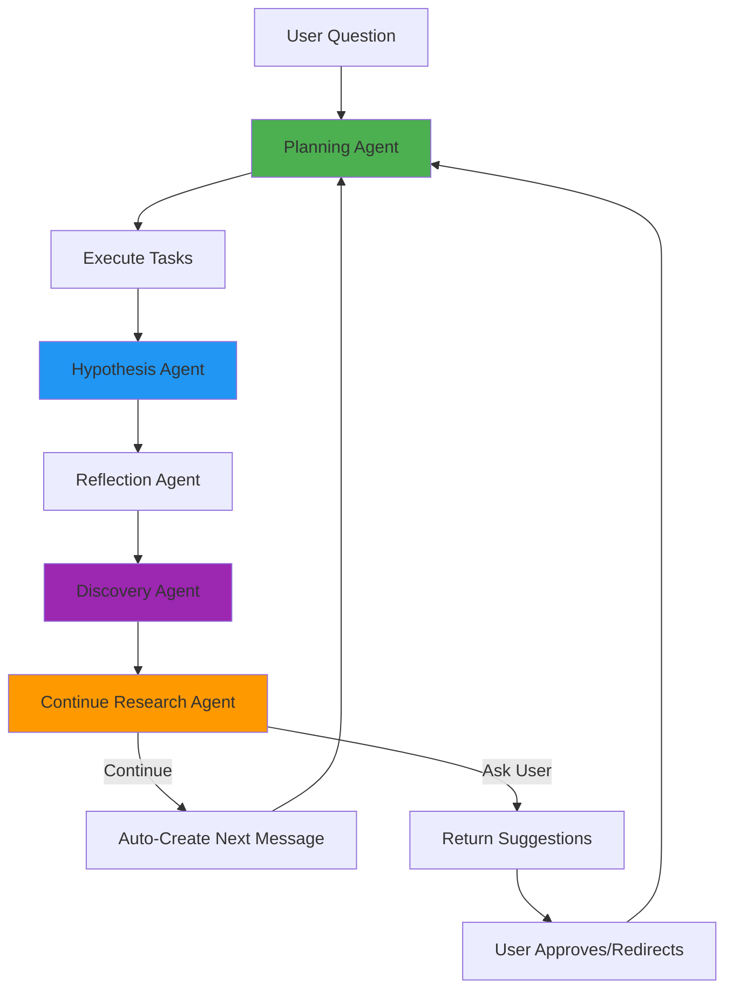

## Overview

Deep Research Mode is the **primary way to use BioAgents**. It enables iterative, hypothesis-driven research through autonomous agent loops with strategic human guidance. Unlike Chat Mode, Deep Research continues across multiple cycles, building on accumulated knowledge until the research objective is satisfied.

<Info>
  **Deep Research is the AI Scientist Framework** - It behaves like a real scientist: iterative, methodical, and hypothesis-driven.
</Info>

## The Iterative Workflow



### Research Cycle Phases

Each iteration consists of:

1. **Planning** - Determines what tasks to execute (LITERATURE + ANALYSIS)
2. **Execution** - Runs tasks in parallel (external services: OpenScholar, Edison, BioAgents API)
3. **Hypothesis** - Synthesizes findings into testable propositions
4. **Reflection** - Extracts insights, evolves objectives, updates methodology
5. **Discovery** - Identifies novel claims with evidence traceability
6. **Continue Decision** - Determines whether to continue autonomously or ask user

## API Endpoint

<CodeGroup>
```bash cURL
curl -X POST https://api.bioagents.ai/api/deep-research/start \
  -H "Authorization: Bearer YOUR_JWT_TOKEN" \
  -H "Content-Type: application/json" \
  -d '{
    "message": "Investigate the molecular mechanisms by which caloric restriction extends lifespan in mammals",
    "researchMode": "semi-autonomous",
    "conversationId": "optional-id"
  }'
```

```typescript TypeScript
interface DeepResearchRequest {
  message: string;
  conversationId?: string;
  researchMode?: 'semi-autonomous' | 'fully-autonomous' | 'steering';
  files?: File[];
  clarificationSessionId?: string; // Pre-approved plan from clarification flow
}

interface DeepResearchResponse {
  messageId: string;
  conversationId: string;
  userId: string;
  status: 'processing' | 'queued';
  pollUrl?: string;  // For x402 users
  jobId?: string;    // For queue mode
}

const response = await fetch('https://api.bioagents.ai/api/deep-research/start', {
  method: 'POST',
  headers: {
    'Authorization': `Bearer ${token}`,
    'Content-Type': 'application/json'
  },
  body: JSON.stringify({
    message: 'Investigate the molecular mechanisms by which caloric restriction extends lifespan in mammals',
    researchMode: 'semi-autonomous'
  })
});

const data: DeepResearchResponse = await response.json();
```

```python Python
import requests

response = requests.post(
    'https://api.bioagents.ai/api/deep-research/start',
    headers={'Authorization': f'Bearer {token}'},
    json={
        'message': 'Investigate the molecular mechanisms by which caloric restriction extends lifespan in mammals',
        'researchMode': 'semi-autonomous'
    }
)

data = response.json()
print(f"Message ID: {data['messageId']}")
print(f"Poll URL: {data.get('pollUrl')}")
```
</CodeGroup>

## Request Parameters

<ParamField path="message" type="string" required>
  The research question or objective
</ParamField>

<ParamField path="conversationId" type="string">
  Existing conversation ID to continue research. Auto-generated if not provided.
</ParamField>

<ParamField path="researchMode" type="string" default="semi-autonomous">
  Research mode: `semi-autonomous`, `fully-autonomous`, or `steering`

  - **semi-autonomous**: Continues for 5 iterations (configurable via `MAX_AUTO_ITERATIONS`)
  - **fully-autonomous**: Continues until done or 20 iterations (hard cap)
  - **steering**: Single iteration only, always asks user for feedback
</ParamField>

<ParamField path="files" type="File[]">
  Optional datasets to upload for analysis
</ParamField>

<ParamField path="clarificationSessionId" type="string">
  ID of approved clarification session (pre-approved research plan)
</ParamField>

## Response Format

### In-Process Mode

```json
{
  "messageId": "550e8400-e29b-41d4-a716-446655440000",
  "conversationId": "abc123",
  "userId": "user456",
  "status": "processing",
  "pollUrl": "https://api.bioagents.ai/api/deep-research/status/550e8400-e29b-41d4-a716-446655440000"
}
```

### Queue Mode

```json
{
  "jobId": "550e8400-e29b-41d4-a716-446655440000",
  "messageId": "550e8400-e29b-41d4-a716-446655440000",
  "conversationId": "abc123",
  "userId": "user456",
  "status": "queued",
  "pollUrl": "https://api.bioagents.ai/api/deep-research/status/550e8400-e29b-41d4-a716-446655440000"
}
```

## Status Polling

```bash
curl https://api.bioagents.ai/api/deep-research/status/550e8400-e29b-41d4-a716-446655440000
```

Response:
```json
{
  "status": "completed",
  "result": {
    "text": "Research complete. Key findings: ...",
    "suggestedNextSteps": [
      {
        "type": "ANALYSIS",
        "objective": "Analyze gene expression data from CR vs control groups",
        "datasets": [...]
      }
    ]
  }
}
```

## World State: Accumulated Knowledge

Deep Research maintains a **World State** that accumulates across iterations:

```typescript src/types/core.ts
interface ConversationStateValues {
  // Objectives
  objective?: string;              // Initial research objective
  evolvingObjective?: string;      // Refined objective as research progresses
  currentObjective?: string;       // Current iteration's objective

  // Hypothesis
  currentHypothesis?: string;      // Latest synthesized hypothesis

  // Accumulated Knowledge
  keyInsights?: string[];          // Extracted insights from literature
  discoveries?: Discovery[];       // Novel findings with evidence links
  methodology?: string;            // Research approach description

  // Planning
  plan?: PlanTask[];               // All tasks across all levels
  currentLevel?: number;           // Current iteration level
  suggestedNextSteps?: PlanTask[]; // Suggestions for next iteration

  // Datasets
  uploadedDatasets?: UploadedFile[]; // File metadata and descriptions

  // Research Mode
  researchMode?: 'semi-autonomous' | 'fully-autonomous' | 'steering';

  // Clarification Context
  clarificationContext?: {
    sessionId: string;
    refinedObjective: string;
    questionsAndAnswers: Array<{ question: string; answer: string }>;
    initialTasks?: PlanTask[];
  };
}
```

<Warning>
  **Critical**: World State MUST persist across iterations. Never treat queries in isolation - always read and update the accumulated knowledge.
</Warning>

## Agent Collaboration

### Planning Agent

**Responsibility**: Decides WHAT tasks to run based on current state and user input.

```typescript src/routes/deep-research/start.ts
const planningResult = await planningAgent({
  state,
  conversationState,
  message: createdMessage,
  mode: "initial",
  usageType: "deep-research",
  researchMode,
});

const plan = planningResult.plan;
const currentObjective = planningResult.currentObjective;

// Get current plan or initialize empty
const currentPlan = conversationState.values.plan || [];

// Find max level in current plan
const maxLevel = currentPlan.length > 0
  ? Math.max(...currentPlan.map((t) => t.level || 0))
  : -1;

// Add new tasks with incremented level
const newLevel = maxLevel + 1;
const newTasks = plan.map((task: PlanTask) => ({
  ...task,
  id: task.type === "ANALYSIS" ? `ana-${newLevel}` : `lit-${newLevel}`,
  level: newLevel,
}));

// Append to existing plan
conversationState.values.plan = [...currentPlan, ...newTasks];
conversationState.values.currentLevel = newLevel;
```

**Returns**: Suggestions (no state mutation)

### Hypothesis Agent

**Responsibility**: Synthesizes task outputs into scientific claims.

```typescript src/routes/deep-research/start.ts
const hypothesisResult = await hypothesisAgent({
  objective: currentObjective,
  message: createdMessage,
  conversationState,
  completedTasks: tasksToExecute,
});

conversationState.values.currentHypothesis = hypothesisResult.hypothesis;
```

**State Updates**: `currentHypothesis`

### Reflection Agent

**Responsibility**: Extracts insights, evolves objectives, updates methodology.

```typescript src/routes/deep-research/start.ts
const reflectionResult = await reflectionAgent({
  conversationState,
  message: createdMessage,
  completedMaxTasks: tasksToExecute,
  hypothesis: hypothesisResult.hypothesis,
});

// Update conversation state
conversationState.values.conversationTitle = reflectionResult.conversationTitle;
conversationState.values.evolvingObjective = reflectionResult.evolvingObjective;
conversationState.values.currentObjective = reflectionResult.currentObjective;
conversationState.values.keyInsights = reflectionResult.keyInsights;
conversationState.values.methodology = reflectionResult.methodology;
```

**State Updates**: `currentObjective`, `keyInsights`, `methodology`, `conversationTitle`, `evolvingObjective`

### Discovery Agent

**Responsibility**: Identifies novel claims and links them to evidence.

```typescript src/routes/deep-research/start.ts
const discoveryResult = await discoveryAgent({
  conversationState,
  message: createdMessage,
  tasksToConsider,
  hypothesis: hypothesisResult.hypothesis,
});

conversationState.values.discoveries = discoveryResult.discoveries;
```

**State Updates**: `discoveries[]`

**Discovery Format**:
```typescript
interface Discovery {
  claim: string;              // The novel finding
  evidence: string;           // Supporting evidence
  novelty: string;            // Why it's novel
  confidence: 'high' | 'medium' | 'low';
  supportingTaskIds: string[]; // Links to tasks (e.g., ["lit-2", "ana-1"])
  supportingJobIds?: string[]; // Links to external jobs
}
```

### Continue Research Agent

**Responsibility**: Decides whether to continue autonomously or ask user.

```typescript src/routes/deep-research/start.ts
const continueResult = await continueResearchAgent({
  conversationState,
  message: currentMessage,
  completedTasks: tasksToExecute,
  hypothesis: hypothesisResult.hypothesis,
  suggestedNextSteps: conversationState.values.suggestedNextSteps,
  iterationCount,
  researchMode,
});

if (continueResult.shouldContinue) {
  // Create auto-continuation message
  const continuationMessage = await createContinuationMessage({
    conversationId,
    userId,
    source,
    stateId: stateRecord.id,
    rootMessageId,
    iterationNumber: iterationCount + 1,
  });

  currentMessage = continuationMessage;
  skipPlanning = true; // Tasks already promoted
  shouldContinueLoop = true;
} else {
  shouldContinueLoop = false;
}
```

**Returns**: `{ shouldContinue: boolean, confidence: string, reasoning: string, triggerReason: string }`

## Task Execution

### Literature Tasks

```typescript src/routes/deep-research/start.ts
if (task.type === "LITERATURE") {
  task.start = new Date().toISOString();
  task.output = "";

  const literaturePromises: Promise<void>[] = [];

  // OpenScholar (if OPENSCHOLAR_API_URL configured)
  if (process.env.OPENSCHOLAR_API_URL) {
    literaturePromises.push(
      literatureAgent({ objective: task.objective, type: "OPENSCHOLAR" })
    );
  }

  // Primary literature (Edison or BioLit)
  const primaryType = process.env.PRIMARY_LITERATURE_AGENT === "BIO"
    ? "BIOLITDEEP"
    : "EDISON";

  literaturePromises.push(
    literatureAgent({ objective: task.objective, type: primaryType })
  );

  // Knowledge base (if KNOWLEDGE_DOCS_PATH configured)
  if (process.env.KNOWLEDGE_DOCS_PATH) {
    literaturePromises.push(
      literatureAgent({ objective: task.objective, type: "KNOWLEDGE" })
    );
  }

  await Promise.all(literaturePromises);
  task.end = new Date().toISOString();
}
```

### Analysis Tasks

```typescript src/routes/deep-research/start.ts
if (task.type === "ANALYSIS") {
  task.start = new Date().toISOString();

  const type = process.env.PRIMARY_ANALYSIS_AGENT === "BIO" ? "BIO" : "EDISON";

  const analysisResult = await analysisAgent({
    objective: task.objective,
    datasets: task.datasets,
    type,
    userId: createdMessage.user_id,
    conversationStateId: conversationState.id,
  });

  task.output = analysisResult.output;
  task.artifacts = analysisResult.artifacts || [];
  task.jobId = analysisResult.jobId;
  task.end = new Date().toISOString();
}
```

<Info>
  **External Services**: LITERATURE and ANALYSIS tasks are executed by external services (OpenScholar, Edison, BioAgents API). This repository cannot control their execution - we only consume outputs.
</Info>

## Research Modes

### Semi-Autonomous (Default)

```bash
MAX_AUTO_ITERATIONS=5  # Configurable
```

- Continues for 5 iterations (default)
- Balances autonomy with human oversight
- Ideal for most research workflows

### Fully Autonomous

```typescript
researchMode: "fully-autonomous"
```

- Continues until research is done or 20 iterations (hard cap)
- Minimal human intervention
- Best for well-defined, exploratory research

### Steering Mode

```typescript
researchMode: "steering"
```

- Single iteration only
- Always asks user for feedback
- Maximum human control

## Deduplication & Run Guard

Deep Research prevents duplicate concurrent runs for the same conversation:

```typescript src/routes/deep-research/start.ts
const activeRun = getActiveRunForDedupFromValues(conversationState.values);

if (activeRun) {
  // Return existing run info instead of starting new one
  return {
    messageId: activeRun.messageId,
    conversationId,
    userId,
    status: "processing",
    pollUrl: buildDeepResearchPollUrl(request, activeRun.messageId, isX402User),
    deduplicated: true,
  };
}

// Mark run as started
await markRunStarted({
  conversationStateId: conversationState.id,
  rootMessageId: createdMessage.id,
  stateId: stateRecord.id,
  mode: runMode,
});
```

**Run State**:
```typescript
interface DeepResearchRun {
  rootMessageId: string;  // Original message that started research
  stateId: string;
  startedAt: string;
  lastHeartbeat?: string;
  jobId?: string;         // For queue mode
  mode: 'queue' | 'in-process';
}
```

## Clarification Flow Integration

Deep Research can start from pre-approved plans:

```typescript src/routes/deep-research/start.ts
if (clarificationSessionId) {
  const clarificationSession = await getClarificationSessionForUser(
    clarificationSessionId,
    userId
  );

  if (clarificationSession.status !== "plan_approved") {
    throw new Error("Clarification session must be approved");
  }

  // Build clarification context
  conversationState.values.clarificationContext = {
    sessionId: clarificationSessionId,
    refinedObjective: clarificationSession.plan.objective,
    questionsAndAnswers,
    initialTasks: clarificationSession.plan.initialTasks,
  };

  // Link session to conversation
  await linkSessionToConversation(clarificationSessionId, conversationId);
}
```

On first iteration, initial tasks are promoted to the plan:

```typescript src/routes/deep-research/start.ts
if (
  iterationCount === 1 &&
  conversationState.values.clarificationContext?.initialTasks?.length
) {
  const initialTasks = conversationState.values.clarificationContext.initialTasks;
  const uploadedDatasets = conversationState.values.uploadedDatasets || [];

  // Resolve datasetFilenames to actual dataset objects
  const newTasks = initialTasks.map((task) => {
    const resolvedDatasets = (task.datasetFilenames || [])
      .map((filename) => uploadedDatasets.find((d) => d.filename === filename))
      .filter((d) => d !== null);

    return {
      objective: task.objective,
      type: task.type,
      datasets: resolvedDatasets,
      id: task.type === "ANALYSIS" ? `ana-${newLevel}` : `lit-${newLevel}`,
      level: newLevel,
    };
  });

  conversationState.values.plan = [...currentPlan, ...newTasks];
  conversationState.values.currentObjective = clarificationContext.refinedObjective;
}
```

## WebSocket Real-Time Updates

Clients can subscribe to real-time progress updates:

```typescript
const ws = new WebSocket('wss://api.bioagents.ai/ws?userId=user123');

ws.onmessage = (event) => {
  const update = JSON.parse(event.data);
  console.log(update);
  // { type: 'state_updated', conversationId: 'abc123', conversationStateId: 'def456' }
  // { type: 'message_updated', messageId: '550e8400-e29b-41d4-a716-446655440000' }
};
```

See [WebSocket documentation](/api-reference/websocket) for details.

## Best Practices

<AccordionGroup>
  <Accordion title="Choosing Research Mode">
    - **Semi-Autonomous**: Best for most research (balances autonomy with oversight)
    - **Fully Autonomous**: Use for well-defined questions without intermediate feedback
    - **Steering**: Use when you want tight control over each iteration
  </Accordion>

  <Accordion title="Providing Initial Context">
    - **Upload datasets**: Provide data files upfront for analysis
    - **Be specific**: Clear research questions get better results
    - **Use clarification flow**: Pre-approve plans for complex research
  </Accordion>

  <Accordion title="Monitoring Progress">
    - **Poll status endpoint**: Check research progress periodically
    - **Use WebSocket**: Subscribe to real-time updates
    - **Check Bull Board**: `/admin/queues` for job inspection (queue mode)
  </Accordion>

  <Accordion title="World State Management">
    - **Never lose discoveries**: Ensure state persistence across iterations
    - **Maintain traceability**: Link claims to evidence (taskId, jobId)
    - **Evolve objectives**: Let objectives refine as research progresses
  </Accordion>
</AccordionGroup>

## Related Resources

<CardGroup cols={2}>
  <Card title="Chat Mode" icon="message-circle" href="/features/chat-mode">
    Quick questions without iteration
  </Card>
  <Card title="Knowledge Base" icon="database" href="/features/knowledge-base">
    Vector search over custom documents
  </Card>
  <Card title="File Upload" icon="upload" href="/features/file-upload">
    Upload datasets for analysis
  </Card>
  <Card title="Paper Generation" icon="file-text" href="/features/paper-generation">
    Generate LaTeX papers from research
  </Card>
</CardGroup>