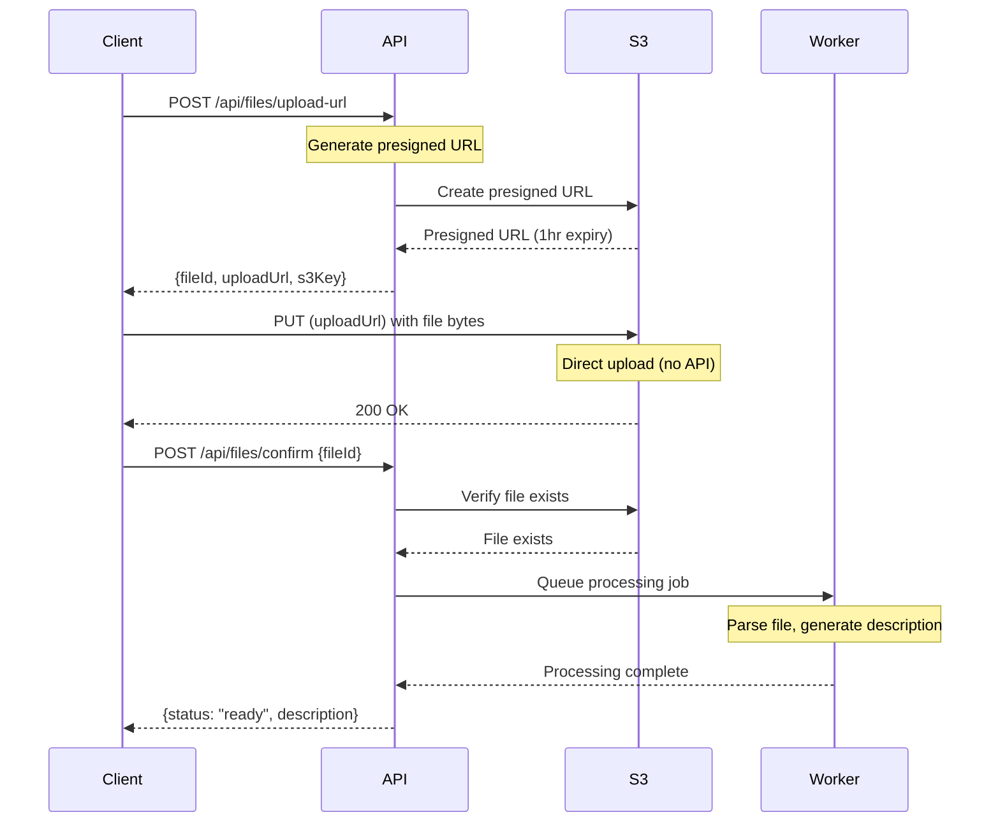

## Overview

BioAgents uses **presigned S3 URLs** for secure, direct-to-storage file uploads. This architecture allows large files (up to 2GB) to be uploaded without passing through the API server, reducing latency and server load.

<Info>
  Files are uploaded directly to S3, then processed asynchronously to generate AI-powered descriptions and metadata.
</Info>

## Architecture



### Why Presigned URLs?

| Benefit | Description |
|---------|-------------|
| **Large files** | Upload up to 2GB without server memory issues |
| **Direct upload** | Files go directly to S3, reducing server load |
| **Security** | URLs are time-limited (1 hour) and size-enforced |
| **Resumable** | Failed uploads can be retried with same URL |
| **Scalable** | No server bottleneck for file transfer |

## Upload Flow

### Step 1: Request Upload URL

<CodeGroup>
```bash cURL
curl -X POST https://api.bioagents.ai/api/files/upload-url \
  -H "Authorization: Bearer YOUR_JWT_TOKEN" \
  -H "Content-Type: application/json" \
  -d '{
    "filename": "dataset.csv",
    "contentType": "text/csv",
    "size": 1048576,
    "conversationId": "optional-conversation-id"
  }'
```

```typescript TypeScript
interface UploadUrlRequest {
  filename: string;
  contentType: string;
  size: number;
  conversationId?: string;
}

interface UploadUrlResponse {
  fileId: string;
  uploadUrl: string;
  s3Key: string;
  expiresAt: string;
  conversationId: string;
  conversationStateId: string;
}

const response = await fetch('https://api.bioagents.ai/api/files/upload-url', {
  method: 'POST',
  headers: {
    'Authorization': `Bearer ${token}`,
    'Content-Type': 'application/json'
  },
  body: JSON.stringify({
    filename: 'dataset.csv',
    contentType: 'text/csv',
    size: 1048576
  })
});

const data: UploadUrlResponse = await response.json();
```

```python Python
import requests

response = requests.post(
    'https://api.bioagents.ai/api/files/upload-url',
    headers={'Authorization': f'Bearer {token}'},
    json={
        'filename': 'dataset.csv',
        'contentType': 'text/csv',
        'size': 1048576
    }
)

data = response.json()
print(f"Upload URL: {data['uploadUrl']}")
```
</CodeGroup>

**Response:**
```json
{
  "fileId": "550e8400-e29b-41d4-a716-446655440000",
  "uploadUrl": "https://bucket.s3.amazonaws.com/user/.../dataset.csv?X-Amz-...",
  "s3Key": "user/abc123/conversation/def456/uploads/dataset.csv",
  "expiresAt": "2024-01-15T12:00:00.000Z",
  "conversationId": "def456",
  "conversationStateId": "ghi789"
}
```

### Step 2: Upload to S3

<CodeGroup>
```bash cURL
curl -X PUT "<uploadUrl>" \
  -H "Content-Type: text/csv" \
  -H "Content-Length: 1048576" \
  --data-binary @dataset.csv
```

```typescript TypeScript
const uploadResponse = await fetch(uploadUrl, {
  method: 'PUT',
  headers: {
    'Content-Type': file.type || 'application/octet-stream',
  },
  body: file,  // File object from input
});

if (!uploadResponse.ok) {
  throw new Error('Upload failed');
}
```

```python Python
with open('dataset.csv', 'rb') as f:
    upload_response = requests.put(
        data['uploadUrl'],
        headers={'Content-Type': 'text/csv'},
        data=f
    )

upload_response.raise_for_status()
```
</CodeGroup>

<Warning>
  The `Content-Length` header must match the `size` declared in Step 1. S3 will reject mismatched sizes with a 403 error.
</Warning>

### Step 3: Confirm Upload

<CodeGroup>
```bash cURL
curl -X POST https://api.bioagents.ai/api/files/confirm \
  -H "Authorization: Bearer YOUR_JWT_TOKEN" \
  -H "Content-Type: application/json" \
  -d '{
    "fileId": "550e8400-e29b-41d4-a716-446655440000"
  }'
```

```typescript TypeScript
const confirmResponse = await fetch('https://api.bioagents.ai/api/files/confirm', {
  method: 'POST',
  headers: {
    'Authorization': `Bearer ${token}`,
    'Content-Type': 'application/json'
  },
  body: JSON.stringify({ fileId: data.fileId })
});

const result = await confirmResponse.json();
console.log(result.description);  // AI-generated description
```

```python Python
confirm_response = requests.post(
    'https://api.bioagents.ai/api/files/confirm',
    headers={'Authorization': f'Bearer {token}'},
    json={'fileId': data['fileId']}
)

result = confirm_response.json()
print(result['description'])
```
</CodeGroup>

**Response:**
```json
{
  "fileId": "550e8400-e29b-41d4-a716-446655440000",
  "status": "ready",
  "filename": "dataset.csv",
  "size": 1048576,
  "description": "RNA-seq data from mouse liver with 12,000 genes across 24 samples"
}
```

## File Processing Pipeline

After confirmation, the file is processed to extract content and generate metadata:

```typescript src/agents/fileUpload/index.ts
export async function fileUploadAgent(input: {
  conversationState: ConversationState;
  files: File[];
  userId: string;
}) {
  const rawFiles = [];

  // Step 1: Parse files
  for (const file of files) {
    const buffer = Buffer.from(await file.arrayBuffer());
    const parsed = await parseFile(buffer, file.name, file.type);

    rawFiles.push({
      buffer,
      filename: file.name,
      mimeType: file.type,
      parsedText: parsed.text,
      metadata: parsed.metadata,
      size: buffer.length,
    });
  }

  // Step 2: Upload to S3
  const uploadedFiles = await uploadFilesToStorage(
    userId,
    conversationStateId,
    rawFiles
  );

  // Step 3: Generate AI descriptions
  const uploadedDatasetsWithDescriptions = await Promise.all(
    uploadedFiles.map(async (file) => {
      const rawFile = rawFiles.find((rf) => rf.filename === file.filename);
      const description = await generateFileDescription(
        file.filename,
        file.mimeType,
        rawFile?.parsedText || ""
      );
      return {
        id: file.id,
        filename: file.filename,
        description,
        path: file.path,
        size: rawFile?.size || 0,
      };
    })
  );

  // Step 4: Update conversation state
  conversationState.values.uploadedDatasets = uploadedDatasetsWithDescriptions;
  await updateConversationState(conversationState.id, conversationState.values);

  return { uploadedDatasets: uploadedDatasetsWithDescriptions, errors: [] };
}
```

### AI-Generated Descriptions

```typescript src/agents/fileUpload/index.ts
async function generateFileDescription(
  filename: string,
  mimeType: string,
  parsedText: string
): Promise<string> {
  const contentPreview = parsedText.slice(0, 1000);

  const prompt = `Analyze this uploaded file and provide a brief 1-sentence description.

Filename: ${filename}
Type: ${mimeType}
Content preview:
${contentPreview}

Provide a concise description (max 100 characters) that would help identify this dataset for analysis tasks. Focus on:
- What type of data it contains (e.g., gene expression, clinical data, etc.)
- Key characteristics if obvious (e.g., number of samples, time period)

Examples:
- "RNA-seq data from mouse liver with 12,000 genes across 24 samples"
- "Clinical trial results comparing drug A vs placebo, n=500 patients"
- "Longitudinal aging biomarkers measured over 2 years"

Description:`;

  const llmProvider = new LLM({
    name: process.env.PLANNING_LLM_PROVIDER || "google",
    apiKey: process.env[`${PLANNING_LLM_PROVIDER.toUpperCase()}_API_KEY`],
  });

  const response = await llmProvider.createChatCompletion({
    model: process.env.PLANNING_LLM_MODEL || "gemini-2.5-flash",
    messages: [{ role: "user", content: prompt }],
    maxTokens: 100,
  });

  return response.content.trim();
}
```

## Supported File Types

```typescript src/agents/fileUpload/config.ts
export const FILE_TYPES = [
  {
    name: "Excel",
    extensions: [".xlsx", ".xls"],
    mimeTypes: [
      "application/vnd.openxmlformats-officedocument.spreadsheetml.sheet",
      "application/vnd.ms-excel",
    ],
    parser: parseExcel,
  },
  {
    name: "CSV",
    extensions: [".csv"],
    mimeTypes: ["text/csv"],
    parser: parseCSV,
  },
  {
    name: "Markdown",
    extensions: [".md"],
    mimeTypes: ["text/markdown"],
    parser: parseMarkdown,
  },
  {
    name: "JSON",
    extensions: [".json"],
    mimeTypes: ["application/json"],
    parser: parseJSON,
  },
  {
    name: "Text",
    extensions: [".txt"],
    mimeTypes: ["text/plain"],
    parser: parseText,
  },
  {
    name: "PDF",
    extensions: [".pdf"],
    mimeTypes: ["application/pdf"],
    parser: parsePDF,
  },
  {
    name: "Image",
    extensions: [".png", ".jpg", ".jpeg", ".webp", ".gif"],
    mimeTypes: ["image/png", "image/jpeg", "image/webp", "image/gif"],
    parser: parseImage,
  },
];
```

### Parser Examples

<Tabs>
  <Tab title="CSV">
    ```typescript src/agents/fileUpload/parsers.ts
    export async function parseCSV(
      buffer: Buffer,
      filename: string
    ): Promise<ParsedFile> {
      const text = buffer.toString("utf-8");
      const result = Papa.parse(text, {
        header: true,
        skipEmptyLines: true,
      });

      const headers = result.meta.fields || [];
      let formattedText = headers.join(", ") + "\n";

      for (const row of result.data as Record<string, any>[]) {
        const values = headers.map((h) => row[h] || "");
        formattedText += values.join(", ") + "\n";
      }

      return {
        filename,
        mimeType: "text/csv",
        text: formattedText,
        metadata: {
          rows: result.data.length,
          columns: headers.length,
          headers,
        },
      };
    }
    ```
  </Tab>

  <Tab title="Excel">
    ```typescript src/agents/fileUpload/parsers.ts
    export async function parseExcel(
      buffer: Buffer,
      filename: string
    ): Promise<ParsedFile> {
      const workbook = XLSX.read(buffer, { type: "buffer" });
      let allText = "";

      for (const sheetName of workbook.SheetNames) {
        const worksheet = workbook.Sheets[sheetName];
        const csv = XLSX.utils.sheet_to_csv(worksheet);
        allText += `\n=== Sheet: ${sheetName} ===\n${csv}\n`;
      }

      return {
        filename,
        mimeType: "application/vnd.openxmlformats-officedocument.spreadsheetml.sheet",
        text: allText.trim(),
        metadata: {
          sheets: workbook.SheetNames,
          sheetCount: workbook.SheetNames.length,
        },
      };
    }
    ```
  </Tab>

  <Tab title="PDF">
    ```typescript src/agents/fileUpload/parsers.ts
    export async function parsePDF(
      buffer: Buffer,
      filename: string
    ): Promise<ParsedFile> {
      // Note: PDF parsing is limited to text extraction
      // Visual elements (charts, images) are not extracted
      return {
        filename,
        mimeType: "application/pdf",
        text: `[PDF Document: ${filename}]\nSize: ${formatFileSize(buffer.length)}\nNote: PDF content will be analyzed by the AI model.`,
        metadata: {
          size: buffer.length,
          type: "pdf",
        },
      };
    }
    ```
  </Tab>

  <Tab title="Image">
    ```typescript src/agents/fileUpload/parsers.ts
    export async function parseImage(
      buffer: Buffer,
      filename: string,
      mimeType: string
    ): Promise<ParsedFile> {
      // Determine image type
      let imageType = "image";
      if (mimeType.includes("png")) imageType = "PNG";
      else if (mimeType.includes("jpeg") || mimeType.includes("jpg")) imageType = "JPEG";
      else if (mimeType.includes("webp")) imageType = "WebP";
      else if (mimeType.includes("gif")) imageType = "GIF";

      return {
        filename,
        mimeType,
        text: `[${imageType} Image: ${filename}]\nSize: ${formatFileSize(buffer.length)}\nNote: Image will be analyzed visually by the AI model.`,
        metadata: {
          size: buffer.length,
          type: "image",
          imageType,
        },
      };
    }
    ```
  </Tab>
</Tabs>

## Configuration

### Environment Variables

```bash .env
# Storage Provider
STORAGE_PROVIDER=s3

# AWS Configuration
AWS_ACCESS_KEY_ID=your-access-key
AWS_SECRET_ACCESS_KEY=your-secret-key
AWS_REGION=us-east-1
S3_BUCKET=your-bucket-name

# For S3-compatible services (DigitalOcean Spaces, MinIO, etc.)
S3_ENDPOINT=https://nyc3.digitaloceanspaces.com

# File Size Limits
MAX_FILE_SIZE_MB=2048  # 2GB default
```

### CORS Configuration

For S3-compatible services, configure CORS to allow direct uploads:

```json
{
  "CORSRules": [
    {
      "AllowedOrigins": ["https://your-domain.com"],
      "AllowedMethods": ["GET", "PUT", "POST", "DELETE"],
      "AllowedHeaders": ["*"],
      "MaxAgeSeconds": 3600
    }
  ]
}
```

## Integration with Chat/Deep Research

Files can be uploaded inline with chat or deep research requests:

```typescript
const formData = new FormData();
formData.append('message', 'Analyze this gene expression data');
formData.append('files', csvFile);
formData.append('files', metadataFile);

const response = await fetch('https://api.bioagents.ai/api/chat', {
  method: 'POST',
  headers: {
    'Authorization': `Bearer ${token}`,
  },
  body: formData
});
```

**Backend Flow:**

```typescript src/routes/chat.ts
// Extract files from parsed body
let files: File[] = [];
if (parsedBody.files) {
  if (Array.isArray(parsedBody.files)) {
    files = parsedBody.files.filter((f: any) => f instanceof File);
  } else if (parsedBody.files instanceof File) {
    files = [parsedBody.files];
  }
}

// Process files before planning
if (files.length > 0) {
  const { fileUploadAgent } = await import("../agents/fileUpload");

  const fileResult = await fileUploadAgent({
    conversationState,
    files,
    userId: state.values.userId,
  });

  // Files are now available in conversationState.values.uploadedDatasets
}
```

## React Hook Example

```typescript
import { useState } from 'react';

interface UploadState {
  isUploading: boolean;
  progress: number;
  error: string | null;
}

export function useFileUpload(apiUrl: string, authToken: string) {
  const [state, setState] = useState<UploadState>({
    isUploading: false,
    progress: 0,
    error: null,
  });

  const upload = async (file: File, conversationId?: string) => {
    setState({ isUploading: true, progress: 0, error: null });

    try {
      // Step 1: Get upload URL
      setState(s => ({ ...s, progress: 10 }));
      const urlRes = await fetch(`${apiUrl}/api/files/upload-url`, {
        method: 'POST',
        headers: {
          'Authorization': `Bearer ${authToken}`,
          'Content-Type': 'application/json',
        },
        body: JSON.stringify({
          filename: file.name,
          contentType: file.type,
          size: file.size,
          conversationId,
        }),
      });

      if (!urlRes.ok) throw new Error('Failed to get upload URL');
      const { fileId, uploadUrl } = await urlRes.json();

      // Step 2: Upload to S3
      setState(s => ({ ...s, progress: 30 }));
      const uploadRes = await fetch(uploadUrl, {
        method: 'PUT',
        headers: { 'Content-Type': file.type },
        body: file,
      });

      if (!uploadRes.ok) throw new Error('Upload failed');

      // Step 3: Confirm
      setState(s => ({ ...s, progress: 80 }));
      const confirmRes = await fetch(`${apiUrl}/api/files/confirm`, {
        method: 'POST',
        headers: {
          'Authorization': `Bearer ${authToken}`,
          'Content-Type': 'application/json',
        },
        body: JSON.stringify({ fileId }),
      });

      if (!confirmRes.ok) throw new Error('Confirm failed');

      setState({ isUploading: false, progress: 100, error: null });
      return confirmRes.json();
    } catch (error) {
      setState({
        isUploading: false,
        progress: 0,
        error: error instanceof Error ? error.message : 'Upload failed',
      });
      throw error;
    }
  };

  return { ...state, upload };
}
```

## Security

### Size Enforcement

Presigned URLs are signed with the exact `Content-Length`:

```typescript
// S3 will reject uploads with different sizes
// Declared: 1MB
// Attempted: 5GB
// Result: 403 SignatureDoesNotMatch
```

### URL Expiration

Presigned URLs expire after **1 hour**:
- Upload attempts fail with 403 after expiration
- Client must request a new URL

### Authentication

All file upload endpoints require authentication:
- JWT token (`Authorization: Bearer <token>`)
- API key (`X-API-Key: <key>`)
- x402/b402 payment protocols

### File Ownership

Files are scoped to:
- User ID (from auth token)
- Conversation ID
- Users can only access their own files

## Troubleshooting

<AccordionGroup>
  <Accordion title="Upload URL Request Failed">
    **Error:** `Storage provider not configured`

    **Solution:**
    ```bash
    # Ensure S3 is configured in .env
    STORAGE_PROVIDER=s3
    AWS_ACCESS_KEY_ID=...
    AWS_SECRET_ACCESS_KEY=...
    S3_BUCKET=...
    ```
  </Accordion>

  <Accordion title="S3 Upload Failed with 403">
    **Error:** `SignatureDoesNotMatch` or `AccessDenied`

    **Solutions:**
    1. **Size mismatch**: Ensure `Content-Length` matches declared `size`
    2. **URL expired**: Request a new upload URL (valid for 1 hour)
    3. **CORS**: Configure CORS on your S3 bucket
    4. **Credentials**: Verify AWS credentials have PutObject permission
  </Accordion>

  <Accordion title="CORS Error in Browser">
    **Error:** `Access-Control-Allow-Origin` error

    **Solution:** Configure CORS on your S3/Spaces bucket:
    - Allow your frontend domain
    - Allow PUT method
    - Allow Content-Type header
  </Accordion>

  <Accordion title="File Processing Stuck">
    **Error:** Status remains `processing`

    **Solutions:**
    1. Check worker logs: `docker compose logs -f worker`
    2. Verify job queue is running: `USE_JOB_QUEUE=true`
    3. Check Bull Board: `/admin/queues`
  </Accordion>
</AccordionGroup>

## Related Resources

<CardGroup cols={2}>
  <Card title="Chat Mode" icon="message-circle" href="/features/chat-mode">
    Upload files with chat requests
  </Card>
  <Card title="Deep Research" icon="microscope" href="/features/deep-research-mode">
    Use files in research workflows
  </Card>
  <Card title="Knowledge Base" icon="database" href="/features/knowledge-base">
    Index uploaded documents
  </Card>
  <Card title="Paper Generation" icon="file-text" href="/features/paper-generation">
    Reference uploaded datasets in papers
  </Card>
</CardGroup>