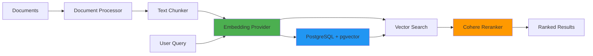

## Overview

The Knowledge Base system enables semantic search over custom documents using vector embeddings. Upload your own research papers, documentation, or datasets to create a private knowledge base that agents can query during literature search.

<Card title="Use Cases" icon="lightbulb">
  - Search internal research documentation
  - Query proprietary datasets and protocols
  - Retrieve information from uploaded papers
  - Cross-reference findings with custom knowledge
</Card>

## Architecture



### Components

1. **Document Processor** - Extracts text from PDF, DOCX, Markdown
2. **Text Chunker** - Splits documents into searchable chunks
3. **Embedding Provider** - Generates vector embeddings (Voyage AI, OpenAI, Cohere)
4. **pgvector** - PostgreSQL extension for vector similarity search
5. **Cohere Reranker** - Two-stage retrieval for precision

## Configuration

### Environment Variables

```bash .env
# Knowledge Base Path
KNOWLEDGE_DOCS_PATH=/path/to/your/documents

# Embedding Provider (voyage, openai, cohere)
EMBEDDING_PROVIDER=voyage
VOYAGE_API_KEY=your-voyage-api-key

# Embedding Model
TEXT_EMBEDDING_MODEL=voyage-3
EMBEDDING_DIMENSIONS=1024

# Search Configuration
SIMILARITY_THRESHOLD=0.5
VECTOR_SEARCH_LIMIT=20
RERANK_FINAL_LIMIT=5
RERANKER_SCORE_THRESHOLD=0.3

# Reranking
USE_RERANKING=true
COHERE_API_KEY=your-cohere-api-key
```

### Embedding Providers

<Tabs>
  <Tab title="Voyage AI (Recommended)">
    ```bash
    EMBEDDING_PROVIDER=voyage
    VOYAGE_API_KEY=your-api-key
    TEXT_EMBEDDING_MODEL=voyage-3
    EMBEDDING_DIMENSIONS=1024
    ```

    **Why Voyage?**
    - Highest quality embeddings for scientific text
    - Superior retrieval performance
    - Optimized for long documents
  </Tab>

  <Tab title="OpenAI">
    ```bash
    EMBEDDING_PROVIDER=openai
    OPENAI_API_KEY=your-api-key
    TEXT_EMBEDDING_MODEL=text-embedding-3-large
    EMBEDDING_DIMENSIONS=3072
    ```

    **When to use OpenAI:**
    - Already using OpenAI for LLM
    - Prefer single provider for simplicity
    - Good general-purpose embeddings
  </Tab>

  <Tab title="Cohere">
    ```bash
    EMBEDDING_PROVIDER=cohere
    COHERE_API_KEY=your-api-key
    TEXT_EMBEDDING_MODEL=embed-english-v3.0
    EMBEDDING_DIMENSIONS=1024
    ```

    **When to use Cohere:**
    - Using Cohere Reranker (same API key)
    - Cost-effective option
    - Strong multilingual support
  </Tab>
</Tabs>

## Database Setup

Enable pgvector extension in PostgreSQL:

```sql src/embeddings/setup.sql
-- Enable pgvector extension
CREATE EXTENSION IF NOT EXISTS vector;

-- Create documents table
CREATE TABLE IF NOT EXISTS documents (
  id UUID PRIMARY KEY DEFAULT gen_random_uuid(),
  title TEXT NOT NULL,
  content TEXT NOT NULL,
  metadata JSONB DEFAULT '{}',
  embedding VECTOR(1024), -- Adjust dimensions based on model
  created_at TIMESTAMP WITH TIME ZONE DEFAULT NOW()
);

-- Create index for vector similarity search
CREATE INDEX IF NOT EXISTS documents_embedding_idx
  ON documents
  USING ivfflat (embedding vector_cosine_ops)
  WITH (lists = 100);

-- Create full-text search index
CREATE INDEX IF NOT EXISTS documents_content_idx
  ON documents
  USING gin(to_tsvector('english', content));

-- Vector similarity search function
CREATE OR REPLACE FUNCTION match_documents(
  query_embedding VECTOR(1024),
  match_threshold FLOAT DEFAULT 0.5,
  match_count INT DEFAULT 10
)
RETURNS TABLE (
  id UUID,
  title TEXT,
  content TEXT,
  metadata JSONB,
  similarity FLOAT
)
LANGUAGE sql
STABLE
AS $$
  SELECT
    id,
    title,
    content,
    metadata,
    1 - (embedding <=> query_embedding) AS similarity
  FROM documents
  WHERE 1 - (embedding <=> query_embedding) > match_threshold
  ORDER BY embedding <=> query_embedding
  LIMIT match_count;
$$;
```

## Document Processing

### Supported File Types

| Format | Extensions | Notes |
|--------|------------|-------|
| Markdown | `.md` | Front-matter support |
| PDF | `.pdf` | Text extraction only |
| Word | `.docx` | Requires mammoth |

### Document Processor

```typescript src/embeddings/documentProcessor.ts
import matter from "front-matter";
import mammoth from "mammoth";
import { PDFParse } from "pdf-parse";

export class DocumentProcessor {
  async processFile(filePath: string): Promise<ProcessedDocument | null> {
    const ext = path.extname(filePath).toLowerCase();
    let content: string;
    let frontMatterData: any = {};

    switch (ext) {
      case ".md":
        const rawContent = await fs.readFile(filePath, "utf-8");
        const parsed = matter(rawContent);
        frontMatterData = parsed.attributes;
        content = parsed.body;
        break;

      case ".docx":
        const buffer = await fs.readFile(filePath);
        const result = await mammoth.extractRawText({ buffer });
        content = result.value;
        break;

      case ".pdf":
        const parser = new PDFParse({ url: filePath });
        const pdfResult = await parser.getText();
        await parser.destroy();
        content = pdfResult.text;
        break;

      default:
        return null;
    }

    return {
      title: path.basename(filePath),
      content: content.trim(),
      metadata: {
        filePath,
        type: ext.slice(1),
        size: stats.size,
        lastModified: stats.mtime,
        ...frontMatterData,
      },
    };
  }

  async processDirectory(dirPath: string): Promise<ProcessedDocument[]> {
    const documents: ProcessedDocument[] = [];
    const entries = await fs.readdir(dirPath, { withFileTypes: true });

    for (const entry of entries) {
      const fullPath = path.join(dirPath, entry.name);

      if (entry.isDirectory()) {
        const subDocs = await this.processDirectory(fullPath);
        documents.push(...subDocs);
      } else if (entry.isFile()) {
        const doc = await this.processFile(fullPath);
        if (doc) documents.push(doc);
      }
    }

    return documents;
  }
}
```

## Vector Search Pipeline

### Two-Stage Retrieval

The system uses a two-stage approach for optimal precision:

1. **Vector Search** - Fast approximate nearest neighbor search (20 results)
2. **Reranking** - Precise relevance scoring using Cohere (top 5)

```typescript src/embeddings/vectorSearch.ts
export class VectorSearchWithReranker {
  async search(
    query: string,
    options: {
      vectorLimit?: number;      // Stage 1: Vector search limit (default: 20)
      finalLimit?: number;       // Stage 2: Final results after reranking (default: 5)
      useReranking?: boolean;    // Enable/disable reranking (default: true)
    } = {}
  ): Promise<Document[]> {
    const {
      vectorLimit = CONFIG.VECTOR_SEARCH_LIMIT,
      finalLimit = CONFIG.RERANK_FINAL_LIMIT,
      useReranking = CONFIG.USE_RERANKING,
    } = options;

    // Stage 1: Vector search
    const vectorResults = await this.vectorSearch(query, vectorLimit);

    if (vectorResults.length === 0) {
      return [];
    }

    // Stage 2: Rerank with Cohere
    if (useReranking && vectorResults.length > 1) {
      return await this.rerank(query, vectorResults, finalLimit);
    }

    return vectorResults.slice(0, finalLimit);
  }
}
```

### Vector Search (Stage 1)

```typescript src/embeddings/vectorSearch.ts
async vectorSearch(query: string, limit = 20): Promise<Document[]> {
  // Generate query embedding
  const queryEmbedding = await this.embeddingProvider.generateEmbedding(query);

  // Cosine similarity search via pgvector
  const { data, error } = await supabase.rpc("match_documents", {
    query_embedding: queryEmbedding,
    match_threshold: CONFIG.SIMILARITY_THRESHOLD,  // Default: 0.5
    match_count: limit,
  });

  if (error) throw error;

  return data.map((doc: any) => ({
    id: doc.id,
    title: doc.title,
    content: doc.content,
    metadata: doc.metadata,
    similarity: doc.similarity,  // Cosine similarity score
  }));
}
```

### Reranking (Stage 2)

```typescript src/embeddings/vectorSearch.ts
async rerank(
  query: string,
  documents: Document[],
  topN = 5
): Promise<Document[]> {
  const response = await cohere.rerank({
    model: "rerank-english-v3.0",
    query: query,
    documents: documents.map((doc) => ({
      text: `${doc.title}\n${doc.content}`,
    })),
    topN: Math.min(topN, documents.length),
    returnDocuments: true,
  });

  // Filter by relevance score threshold
  const rerankedResults = response.results
    .map((result) => ({
      ...documents[result.index],
      relevanceScore: result.relevanceScore,
    }))
    .filter((doc) => doc.relevanceScore >= CONFIG.RERANKER_SCORE_THRESHOLD);

  return rerankedResults;
}
```

## Integration with Literature Agent

Knowledge Base is automatically queried during literature searches:

```typescript src/agents/literature/knowledge.ts
export async function initKnowledgeBase() {
  const docsPath = process.env.KNOWLEDGE_DOCS_PATH;

  if (!docsPath) {
    logger.info("KNOWLEDGE_DOCS_PATH not set, skipping knowledge base initialization");
    return;
  }

  const vectorSearch = new VectorSearchWithReranker();
  const processor = new DocumentProcessor();

  // Process all documents in directory
  const documents = await processor.processDirectory(docsPath);

  if (documents.length === 0) {
    logger.warn("No documents found in KNOWLEDGE_DOCS_PATH");
    return;
  }

  // Add to vector database
  await vectorSearch.addDocuments(documents);

  logger.info(`Knowledge base initialized with ${documents.length} documents`);
}
```

**Usage in Chat/Deep Research:**

```typescript src/routes/chat.ts
// Knowledge base is queried if KNOWLEDGE_DOCS_PATH is configured
if (process.env.KNOWLEDGE_DOCS_PATH) {
  const knowledgePromise = literatureAgent({
    objective: task.objective,
    type: "KNOWLEDGE",
  }).then((result) => {
    if (result.count && result.count > 0) {
      task.output += `${result.output}\n\n`;
    }
  });
  literaturePromises.push(knowledgePromise);
}
```

## Adding Documents

### Via File System

```bash
# Set documents path
export KNOWLEDGE_DOCS_PATH=/path/to/docs

# Add documents
mkdir -p /path/to/docs
cp research_paper.pdf /path/to/docs/
cp protocol.md /path/to/docs/

# Restart server to reindex
bun run dev
```

### Via API

```typescript
import { VectorSearchWithReranker } from "./embeddings/vectorSearch";

const vectorSearch = new VectorSearchWithReranker();

// Add single document
await vectorSearch.addDocument(
  "Research Paper Title",
  "Full text content...",
  { author: "Jane Doe", year: 2024 }
);

// Add batch
await vectorSearch.addDocuments([
  {
    title: "Paper 1",
    content: "Content 1...",
    metadata: { author: "Author 1" }
  },
  {
    title: "Paper 2",
    content: "Content 2...",
    metadata: { author: "Author 2" }
  }
]);
```

## Search API

### Direct Search

```typescript
const vectorSearch = new VectorSearchWithReranker();

const results = await vectorSearch.search(
  "What are the mechanisms of autophagy?",
  {
    vectorLimit: 20,    // Stage 1: Vector search
    finalLimit: 5,      // Stage 2: Reranked results
    useReranking: true  // Enable reranking
  }
);

console.log(results);
// [
//   {
//     id: "550e8400-e29b-41d4-a716-446655440000",
//     title: "Autophagy in Aging",
//     content: "Full document text...",
//     metadata: { filePath: "/docs/autophagy.pdf" },
//     similarity: 0.87,       // Cosine similarity
//     relevanceScore: 0.95    // Reranker score
//   }
// ]
```

### Get Statistics

```typescript
const stats = await vectorSearch.getStats();

console.log(stats);
// {
//   totalDocuments: 42,
//   embeddingProvider: "voyage",
//   embeddingModel: "voyage-3",
//   embeddingDimensions: 1024
// }
```

## Performance Tuning

### Vector Index Configuration

```sql
-- IVFFlat index for approximate nearest neighbor search
CREATE INDEX documents_embedding_idx
  ON documents
  USING ivfflat (embedding vector_cosine_ops)
  WITH (lists = 100);  -- Increase for larger datasets
```

**Index Guidelines:**
- **lists = 100**: Good for < 10,000 documents
- **lists = 200**: Good for 10,000 - 100,000 documents
- **lists = 500**: Good for > 100,000 documents

### Caching

Search results are cached for 5 minutes:

```typescript src/embeddings/vectorSearch.ts
const cacheKey = `search_${query}_${vectorLimit}_${finalLimit}_${useReranking}`;
const cached = this.cache.get(cacheKey);
if (cached) return cached;

// ... perform search ...

this.cache.set(cacheKey, finalResults, 300000); // 5 min cache
```

### Batch Processing

```typescript
// Process documents in batches to avoid rate limits
const batchSize = 10;
for (let i = 0; i < documents.length; i += batchSize) {
  const batch = documents.slice(i, i + batchSize);
  await vectorSearch.addDocuments(batch);
  await new Promise(resolve => setTimeout(resolve, 1000)); // Rate limit
}
```

## Best Practices

<AccordionGroup>
  <Accordion title="Choosing Embedding Models">
    - **Voyage AI**: Best for scientific/technical content
    - **OpenAI**: Good general-purpose option
    - **Cohere**: Cost-effective, strong multilingual

    Always match `EMBEDDING_DIMENSIONS` to your model!
  </Accordion>

  <Accordion title="Document Chunking">
    - Keep chunks < 1000 tokens for optimal embedding quality
    - Preserve context: don't split mid-sentence
    - Use overlapping chunks for continuity
  </Accordion>

  <Accordion title="Similarity Thresholds">
    - `SIMILARITY_THRESHOLD=0.5`: Good default (cosine similarity)
    - `RERANKER_SCORE_THRESHOLD=0.3`: Filters low-quality reranked results
    - Adjust based on precision/recall needs
  </Accordion>

  <Accordion title="Reranking Strategy">
    - Always use reranking for user-facing queries (better precision)
    - Disable reranking for high-throughput batch processing
    - Increase `vectorLimit` if top results are poor
  </Accordion>
</AccordionGroup>

## Troubleshooting

<AccordionGroup>
  <Accordion title="No results returned">
    **Possible causes:**
    - Similarity threshold too high (lower `SIMILARITY_THRESHOLD`)
    - No documents indexed (check `getStats()`)
    - Query too specific (broaden search terms)

    **Solution:**
    ```bash
    # Check document count
    SELECT COUNT(*) FROM documents;

    # Lower threshold
    SIMILARITY_THRESHOLD=0.3
    ```
  </Accordion>

  <Accordion title="Poor search quality">
    **Possible causes:**
    - Weak embedding model
    - Reranking disabled
    - Insufficient vector search candidates

    **Solution:**
    ```bash
    # Use better embedding model
    EMBEDDING_PROVIDER=voyage
    TEXT_EMBEDDING_MODEL=voyage-3

    # Enable reranking
    USE_RERANKING=true

    # Increase candidates for reranking
    VECTOR_SEARCH_LIMIT=50
    RERANK_FINAL_LIMIT=10
    ```
  </Accordion>

  <Accordion title="Slow queries">
    **Possible causes:**
    - Missing vector index
    - Index needs tuning
    - Cold cache

    **Solution:**
    ```sql
    -- Rebuild index with more lists
    DROP INDEX documents_embedding_idx;
    CREATE INDEX documents_embedding_idx
      ON documents
      USING ivfflat (embedding vector_cosine_ops)
      WITH (lists = 200);

    -- Analyze table
    ANALYZE documents;
    ```
  </Accordion>
</AccordionGroup>

## Related Resources

<CardGroup cols={2}>
  <Card title="Chat Mode" icon="message-circle" href="/features/chat-mode">
    Query knowledge base via chat
  </Card>
  <Card title="Deep Research" icon="microscope" href="/features/deep-research-mode">
    Use knowledge base in research cycles
  </Card>
  <Card title="File Upload" icon="upload" href="/features/file-upload">
    Upload documents to knowledge base
  </Card>
  <Card title="pgvector Docs" icon="external-link" href="https://github.com/pgvector/pgvector">
    PostgreSQL vector extension
  </Card>
</CardGroup>