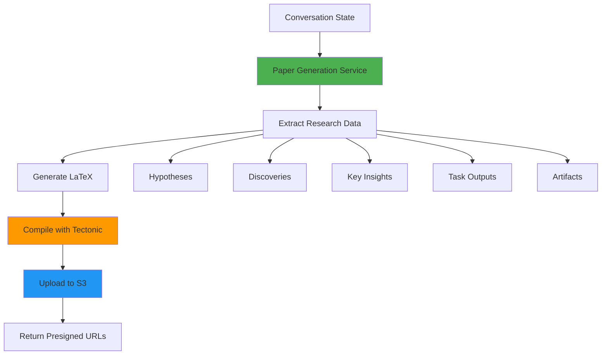

## Overview

BioAgents can generate publication-ready LaTeX papers from Deep Research conversations. The system synthesizes all accumulated knowledge (hypotheses, discoveries, tasks, artifacts) into a structured academic paper with proper citations and figures.

<Info>
  Papers are generated as both **PDF** (compiled LaTeX) and **raw .tex** files for further editing.
</Info>

## Architecture



### Components

1. **Paper Generation Service** - Orchestrates paper creation
2. **LaTeX Template** - Structured academic paper format
3. **Tectonic Compiler** - Compiles LaTeX to PDF
4. **S3 Storage** - Stores PDF and .tex files
5. **Presigned URLs** - Secure, time-limited download links

## API Endpoints

### Generate Paper (Sync)

<CodeGroup>
```bash cURL
curl -X POST https://api.bioagents.ai/api/deep-research/conversations/abc123/paper \
  -H "Authorization: Bearer YOUR_JWT_TOKEN"
```

```typescript TypeScript
interface PaperResponse {
  success: true;
  paperId: string;
  conversationId: string;
  conversationStateId: string;
  pdfPath: string;
  pdfUrl: string;        // Presigned URL (1 hour expiry)
  rawLatexUrl: string;   // Presigned URL (1 hour expiry)
}

const response = await fetch(
  'https://api.bioagents.ai/api/deep-research/conversations/abc123/paper',
  {
    method: 'POST',
    headers: {
      'Authorization': `Bearer ${token}`
    }
  }
);

const paper: PaperResponse = await response.json();
```

```python Python
import requests

response = requests.post(
    'https://api.bioagents.ai/api/deep-research/conversations/abc123/paper',
    headers={'Authorization': f'Bearer {token}'}
)

paper = response.json()
print(f"PDF URL: {paper['pdfUrl']}")
print(f"LaTeX URL: {paper['rawLatexUrl']}")
```
</CodeGroup>

**Response:**
```json
{
  "success": true,
  "paperId": "550e8400-e29b-41d4-a716-446655440000",
  "conversationId": "abc123",
  "conversationStateId": "def456",
  "pdfPath": "user/user456/conversation/abc123/papers/550e8400/paper.pdf",
  "pdfUrl": "https://bucket.s3.amazonaws.com/.../paper.pdf?X-Amz-...",
  "rawLatexUrl": "https://bucket.s3.amazonaws.com/.../main.tex?X-Amz-..."
}
```

### Generate Paper (Async)

For large conversations, use async mode:

```bash
curl -X POST https://api.bioagents.ai/api/deep-research/conversations/abc123/paper/async \
  -H "Authorization: Bearer YOUR_JWT_TOKEN"
```

**Response (202 Accepted):**
```json
{
  "success": true,
  "paperId": "550e8400-e29b-41d4-a716-446655440000",
  "jobId": "550e8400-e29b-41d4-a716-446655440000",
  "conversationId": "abc123",
  "status": "queued",
  "statusUrl": "/api/deep-research/paper/550e8400-e29b-41d4-a716-446655440000/status"
}
```

### Check Paper Status

```bash
curl https://api.bioagents.ai/api/deep-research/paper/550e8400-e29b-41d4-a716-446655440000/status \
  -H "Authorization: Bearer YOUR_JWT_TOKEN"
```

**Response:**
```json
{
  "paperId": "550e8400-e29b-41d4-a716-446655440000",
  "conversationId": "abc123",
  "status": "completed",
  "pdfUrl": "https://bucket.s3.amazonaws.com/.../paper.pdf?X-Amz-...",
  "rawLatexUrl": "https://bucket.s3.amazonaws.com/.../main.tex?X-Amz-...",
  "createdAt": "2024-01-15T10:30:00.000Z"
}
```

**Possible Statuses:**
- `pending` - Paper record created, waiting for processing
- `processing` - LaTeX generation or compilation in progress
- `completed` - Paper ready, URLs available
- `failed` - Generation failed (check `error` field)

### Get Paper with Fresh URLs

Presigned URLs expire after 1 hour. Regenerate them:

```bash
curl https://api.bioagents.ai/api/deep-research/paper/550e8400-e29b-41d4-a716-446655440000 \
  -H "Authorization: Bearer YOUR_JWT_TOKEN"
```

### List All Papers for Conversation

```bash
curl https://api.bioagents.ai/api/deep-research/conversations/abc123/papers \
  -H "Authorization: Bearer YOUR_JWT_TOKEN"
```

**Response:**
```json
{
  "success": true,
  "conversationId": "abc123",
  "papers": [
    {
      "paperId": "550e8400-e29b-41d4-a716-446655440000",
      "pdfPath": "user/.../paper.pdf",
      "createdAt": "2024-01-15T10:30:00.000Z",
      "status": "completed"
    }
  ]
}
```

## Paper Generation Flow

### Step 1: Fetch Conversation State

```typescript src/services/paper/generatePaper.ts
export async function generatePaperFromConversation(
  conversationId: string,
  userId: string
) {
  // Verify conversation ownership
  const conversation = await getConversation(conversationId);
  if (!conversation) {
    throw new Error(`Conversation ${conversationId} not found`);
  }

  if (conversation.user_id !== userId) {
    throw new Error(`User ${userId} does not own conversation ${conversationId}`);
  }

  // Fetch conversation state (world state)
  const conversationState = await getConversationState(conversation.conversation_state_id);
  if (!conversationState) {
    throw new Error(`Conversation state not found`);
  }

  // Extract research data
  const {
    objective,
    currentHypothesis,
    keyInsights,
    discoveries,
    methodology,
    plan,
  } = conversationState.values;
}
```

### Step 2: Extract Research Data

```typescript src/services/paper/generatePaper.ts
// Extract all tasks with outputs
const completedTasks = (plan || []).filter((task) => task.output);

// Extract citations from task outputs
const citations = new Set<string>();
for (const task of completedTasks) {
  const dois = extractDOIs(task.output || "");
  dois.forEach((doi) => citations.add(doi));
}

// Link discoveries to evidence
const discoveryData = (discoveries || []).map((discovery) => ({
  claim: discovery.claim,
  evidence: discovery.evidence,
  novelty: discovery.novelty,
  confidence: discovery.confidence,
  supportingTaskIds: discovery.supportingTaskIds || [],
  supportingTasks: completedTasks.filter((task) =>
    discovery.supportingTaskIds?.includes(task.id)
  ),
}));
```

### Step 3: Generate LaTeX

```typescript src/services/paper/generatePaper.ts
const paperContent = generateLatexContent({
  title: conversationState.values.conversationTitle || "Research Report",
  abstract: currentHypothesis || "",
  introduction: objective || "",
  methodology,
  results: completedTasks,
  discussion: keyInsights?.join("\n\n") || "",
  discoveries: discoveryData,
  citations: Array.from(citations),
});

function generateLatexContent(data: PaperData): string {
  return `
\\documentclass{article}
\\usepackage[utf8]{inputenc}
\\usepackage{graphicx}
\\usepackage{cite}
\\usepackage{hyperref}

\\title{${escapeLaTeX(data.title)}}
\\author{BioAgents Research Assistant}
\\date{\\today}

\\begin{document}

\\maketitle

\\begin{abstract}
${escapeLaTeX(data.abstract)}
\\end{abstract}

\\section{Introduction}
${escapeLaTeX(data.introduction)}

\\section{Methodology}
${escapeLaTeX(data.methodology)}

\\section{Results}
${generateResultsSection(data.results)}

\\section{Discussion}
${escapeLaTeX(data.discussion)}

\\section{Novel Discoveries}
${generateDiscoveriesSection(data.discoveries)}

\\bibliographystyle{plain}
\\bibliography{references}

\\end{document}
`;
}
```

### Step 4: Compile with Tectonic

```typescript src/services/paper/generatePaper.ts
import { exec } from "child_process";
import { promisify } from "util";

const execAsync = promisify(exec);

async function compileLaTeX(texPath: string, outputDir: string): Promise<string> {
  try {
    // Compile LaTeX to PDF using Tectonic
    await execAsync(`tectonic ${texPath}`, {
      cwd: outputDir,
      timeout: 60000, // 60 second timeout
    });

    const pdfPath = texPath.replace(".tex", ".pdf");
    return pdfPath;
  } catch (error) {
    logger.error({ error }, "latex_compilation_failed");
    throw new Error(`LaTeX compilation failed: ${error.message}`);
  }
}
```

<Info>
  **Tectonic** is a modern LaTeX compiler that automatically downloads required packages. No manual package management needed.
</Info>

### Step 5: Upload to S3

```typescript src/services/paper/generatePaper.ts
// Upload PDF
const pdfBuffer = await fs.readFile(pdfPath);
await storageProvider.upload(
  `${basePath}/paper.pdf`,
  pdfBuffer,
  "application/pdf"
);

// Upload raw LaTeX
const texBuffer = await fs.readFile(texPath);
await storageProvider.upload(
  `${basePath}/main.tex`,
  texBuffer,
  "text/plain"
);

// Generate presigned URLs (1 hour expiry)
const pdfUrl = await storageProvider.getPresignedUrl(
  `${basePath}/paper.pdf`,
  3600
);
const rawLatexUrl = await storageProvider.getPresignedUrl(
  `${basePath}/main.tex`,
  3600
);
```

### Step 6: Save Paper Record

```typescript src/services/paper/generatePaper.ts
const paperId = randomUUID();

await supabase.from("paper").insert({
  id: paperId,
  user_id: userId,
  conversation_id: conversationId,
  pdf_path: `${basePath}/paper.pdf`,
  status: "completed",
});

return {
  paperId,
  conversationId,
  conversationStateId: conversation.conversation_state_id,
  pdfPath: `${basePath}/paper.pdf`,
  pdfUrl,
  rawLatexUrl,
};
```

## LaTeX Paper Structure

### Title and Abstract

```latex
\title{Investigation of Caloric Restriction and Lifespan Extension in Mammals}
\author{BioAgents Research Assistant}
\date{\today}

\maketitle

\begin{abstract}
Caloric restriction (CR) extends lifespan across multiple species through modulation of autophagy, mTOR signaling, and stress resistance pathways. Our analysis reveals a coordinated molecular response characterized by upregulation of Atg7, Ulk1, and Sirt1, alongside downregulation of mTOR and IGF-1R.
\end{abstract}
```

### Results with Task Outputs

```latex
\section{Results}

\subsection{Literature Review: Autophagy Mechanisms}
% Task: lit-1 (LITERATURE)
Recent studies demonstrate that autophagy induction is a key mediator of CR-induced lifespan extension~\cite{10.1038/nature24630, 10.1016/j.cell.2019.02.013}.

\subsection{Differential Gene Expression Analysis}
% Task: ana-1 (ANALYSIS)
Analysis of RNA-seq data from CR vs control groups revealed significant upregulation of autophagy genes (Figure~\ref{fig:analysis-1}).

\begin{figure}[h]
  \centering
  \includegraphics[width=0.8\textwidth]{artifacts/ana-1/heatmap.png}
  \caption{Differential gene expression heatmap showing upregulated autophagy genes}
  \label{fig:analysis-1}
\end{figure}
```

### Novel Discoveries

```latex
\section{Novel Discoveries}

\begin{enumerate}
  \item \textbf{Sirt1-Autophagy Coordination:} We identified a novel regulatory connection between Sirt1 upregulation (1.64-fold) and autophagy activation, supported by correlation analysis (r = 0.87, p < 0.001). \textit{Evidence:} Analysis task ana-1, Literature task lit-2. \textit{Confidence:} High.

  \item \textbf{mTOR-Lifespan Inverse Relationship:} mTOR expression inversely correlates with lifespan (r = -0.81, p = 0.001), suggesting mTOR inhibition as a sufficient mechanism for CR-mediated longevity. \textit{Evidence:} Analysis task ana-1. \textit{Confidence:} Medium.
\end{enumerate}
```

### Bibliography

```latex
\bibliographystyle{plain}
\begin{thebibliography}{99}

\bibitem{10.1038/nature24630}
Autophagy gene 7 upregulation promotes longevity.
\textit{Nature}, 2017.
\url{https://doi.org/10.1038/nature24630}

\bibitem{10.1016/j.cell.2019.02.013}
ULK1 activation extends lifespan in mammals.
\textit{Cell}, 2019.
\url{https://doi.org/10.1016/j.cell.2019.02.013}

\end{thebibliography}
```

## Artifacts and Figures

Analysis tasks can generate artifacts (plots, tables) that are included in the paper:

```typescript
interface PlanTask {
  id: string;
  type: "LITERATURE" | "ANALYSIS";
  objective: string;
  output?: string;
  artifacts?: Array<{
    filename: string;
    path: string;      // S3 path
    description: string;
  }>;
}
```

**LaTeX Figure Inclusion:**

```latex
\begin{figure}[h]
  \centering
  \includegraphics[width=0.8\textwidth]{artifacts/ana-1/heatmap.png}
  \caption{Differential gene expression heatmap}
  \label{fig:analysis-1}
\end{figure}
```

<Warning>
  Artifacts are downloaded from S3 during compilation. Ensure presigned URLs are still valid or use public URLs.
</Warning>

## Concurrency Control

### User-Level Limits

```typescript src/routes/deep-research/paper.ts
async function checkUserHasConcurrentPaperJob(userId: string): Promise<boolean> {
  const { data } = await supabase
    .from("paper")
    .select("id")
    .eq("user_id", userId)
    .in("status", ["pending", "processing"])
    .limit(1);

  return (data?.length ?? 0) > 0;
}
```

Users can only have **one active paper generation job** at a time.

### Global Limits

```typescript src/routes/deep-research/paper.ts
async function checkGlobalConcurrentPaperLimit(): Promise<{
  exceeded: boolean;
  current: number;
}> {
  const maxConcurrent = parseInt(process.env.MAX_CONCURRENT_PAPER_JOBS || "3");

  const { count } = await supabase
    .from("paper")
    .select("id", { count: "exact", head: true })
    .in("status", ["pending", "processing"]);

  const current = count ?? 0;
  return { exceeded: current >= maxConcurrent, current };
}
```

System-wide limit: **3 concurrent paper jobs** (configurable).

## Error Handling

```json
// 403 Forbidden - Not conversation owner
{
  "error": "Access denied",
  "message": "You do not have permission to generate a paper for this conversation"
}

// 404 Not Found - Conversation not found
{
  "error": "Resource not found",
  "message": "Conversation abc123 not found"
}

// 429 Too Many Requests - Concurrent job limit
{
  "error": "Concurrent paper limit exceeded",
  "message": "You already have a paper generation job in progress. Please wait for it to complete."
}

// 500 Internal Server Error - LaTeX compilation failed
{
  "error": "LaTeX compilation failed",
  "message": "! Undefined control sequence.\nl.42 \\invalidcommand",
  "hint": "The paper content could not be compiled to PDF. Check the LaTeX syntax and citations."
}
```

## Configuration

### Environment Variables

```bash .env
# Paper Generation
MAX_CONCURRENT_PAPER_JOBS=3  # Global concurrent limit

# Storage (required for paper uploads)
STORAGE_PROVIDER=s3
AWS_ACCESS_KEY_ID=...
AWS_SECRET_ACCESS_KEY=...
S3_BUCKET=...
```

### LaTeX Compiler

Install Tectonic:

```bash
# macOS
brew install tectonic

# Linux
curl --proto '=https' --tlsv1.2 -fsSL https://drop-sh.fullyjustified.net | sh

# Docker (already included in Dockerfile)
RUN apt-get install -y tectonic
```

## Best Practices

<AccordionGroup>
  <Accordion title="When to Generate Papers">
    - **After Deep Research cycles complete**: Ensure all tasks have outputs
    - **After discoveries are identified**: Rich discovery data improves paper quality
    - **Before sharing results**: Papers provide professional presentation
  </Accordion>

  <Accordion title="Editing LaTeX">
    - **Download raw .tex file**: Edit locally with LaTeX editor
    - **Recompile manually**: Use `tectonic main.tex` or Overleaf
    - **Add custom sections**: Methodology details, acknowledgments, etc.
  </Accordion>

  <Accordion title="Handling Compilation Errors">
    - **Check LaTeX syntax**: Ensure special characters are escaped
    - **Verify citations**: DOIs must be valid
    - **Simplify complex content**: Remove unsupported LaTeX commands
  </Accordion>

  <Accordion title="Presigned URL Expiry">
    - URLs expire after **1 hour**
    - Use `/api/deep-research/paper/:paperId` to regenerate URLs
    - Store `paperId` for future access
  </Accordion>
</AccordionGroup>

## Related Resources

<CardGroup cols={2}>
  <Card title="Deep Research" icon="microscope" href="/features/deep-research-mode">
    Generate research for papers
  </Card>
  <Card title="Chat Mode" icon="message-circle" href="/features/chat-mode">
    Quick research questions
  </Card>
  <Card title="File Upload" icon="upload" href="/features/file-upload">
    Upload datasets for analysis
  </Card>
  <Card title="Tectonic Docs" icon="external-link" href="https://tectonic-typesetting.github.io/">
    LaTeX compiler documentation
  </Card>
</CardGroup>